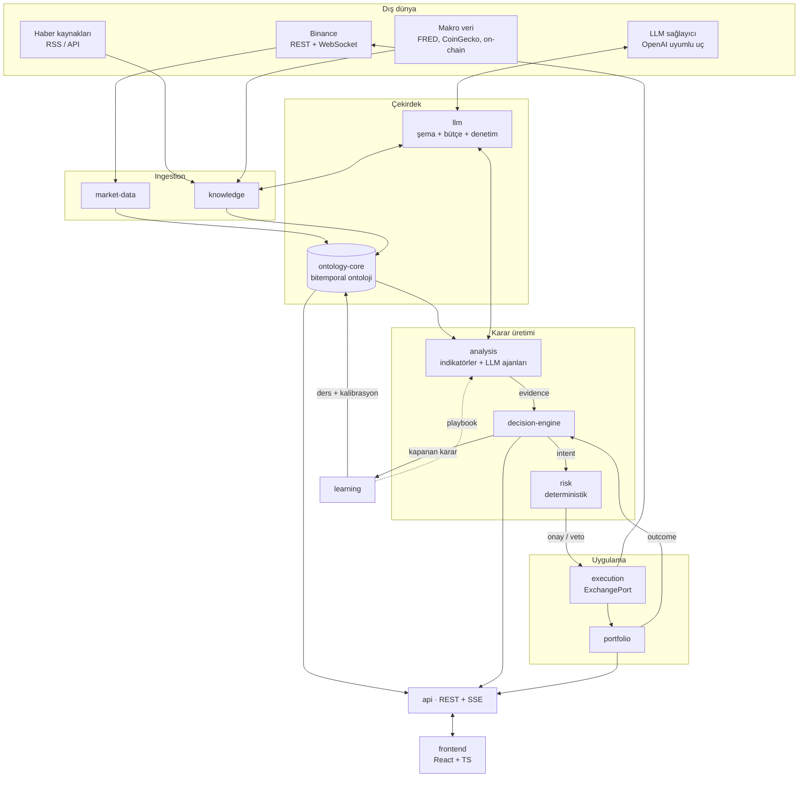
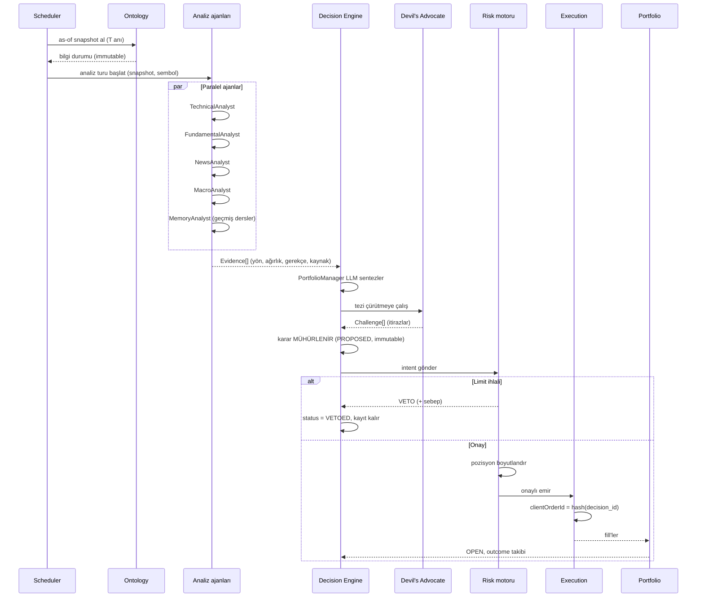
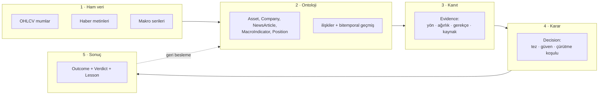

# 01 — Mimari

## Genel yapı

Sistem, **Spring Modulith** ile sınırları zorlanan bir modüler monolittir. Tek deploy
edilebilir birim, ama modüller arası doğrudan sınıf erişimi derleme/test zamanında
engellenir; iletişim yayınlanan domain event'leri üzerinden yürür.



Dikkat edilecek iki ok:

- **`RK -->|onay / veto| EX`** — decision-engine'den execution'a doğrudan ok yok.
  Her emir risk motorundan geçmek zorunda.
- **`LE -.->|playbook| AN`** — öğrenme döngüsü analiz ajanlarının davranışını
  besliyor ama kesikli çizgi: playbook değişikliği otomatik canlıya çıkmaz,
  shadow modda doğrulanır (bkz. [07](07-surekli-ogrenme.md)).

---

## Modüller ve sorumlulukları

| Modül | Sorumluluk | Bağımlı olduğu |
|---|---|---|
| `shared` | Ortak tipler, para/miktar değer nesneleri, saat soyutlaması (`Clock`) | — |
| `ontology-core` | Meta model, instance store, bitemporal yazma/okuma, commit, projeksiyon | `shared` |
| `market-data` | Binance OHLCV/ticker ingest, partition ve rollup yönetimi, canlı fiyat buffer | `ontology-core` |
| `knowledge` | Haber, makro ve on-chain ingest; deduplication; varlık eşleştirme (entity linking) | `ontology-core`, `llm` |
| `llm` | Şemaya zorlanmış LLM erişimi, istem enjeksiyonu savunması, bütçe tavanı, çağrı denetim kaydı | — |
| `analysis` | ta4j indikatörleri, LLM analiz ajanları, kanıt (evidence) üretimi | `ontology-core`, `llm` |
| `decision-engine` | Karar yaşam döngüsü, kanıt birleştirme, kalibrasyon, sonuç değerlendirme | `ontology-core`, `analysis` |
| `risk` | Deterministik limit kontrolleri, pozisyon boyutlandırma, kill-switch | `portfolio` |
| `execution` | `ExchangePort` soyutlaması, Binance adapter, idempotency, reconciliation | `risk` |
| `portfolio` | İç defter, pozisyonlar, PnL, mark-to-market | `market-data` |
| `learning` | Ders çıkarma, kalibrasyon istatistikleri, playbook evrimi | `decision-engine` |
| `api` | REST controller'ları, SSE akışları, DTO'lar, auth | tümü (okuma) |
| `app` | Spring Boot giriş noktası, konfigürasyon, zamanlayıcılar | tümü |

Spring Modulith `ApplicationModuleTest` ile bu bağımlılık grafiği testte doğrulanır;
izinsiz bir `import` build'i kırar.

---

## Karar döngüsü

Sistemin kalbi. Varsayılan olarak her kapanan 15m mumda tetiklenir; sembol başına
ayrı bir tur çalışır.



İki ayrıntı kritik:

**As-of snapshot.** Analiz turu, ontolojiden "T anında bilinen" bir görünüm alır ve tur
boyunca bu görünüm değişmez. Bu hem tekrar üretilebilirliği (aynı girdi → aynı karar)
hem de backtest'in canlıyla birebir aynı kod yolunu kullanmasını sağlar.

**Veto de bir karardır.** Risk motoru bir kararı reddettiğinde kayıt silinmez;
`VETOED` olarak durur ve sonucu yine izlenir ("veto etmeseydik ne olurdu?").
Bu, risk limitlerinin zamanla kalibre edilmesini mümkün kılar.

---

## Veri akışı katmanları



Her katman geçişi **kayıp yaratmaz, ek yapar**: kanıt hangi ontoloji alanından geldiğini
işaret eder, karar hangi kanıtlara dayandığını işaret eder. Bir kararın gerekçe zinciri
ham veriye kadar geriye sürülebilir. Decision Inspector ekranının yaptığı iş budur.

---

## Zamanlama (schedule)

| İş | Sıklık | Modül |
|---|---|---|
| OHLCV WebSocket akışı | sürekli | `market-data` |
| OHLCV boşluk doldurma (backfill) | 5 dk | `market-data` |
| Rollup (1m → 5m/15m/1h/4h/1d) | mum kapanışında | `market-data` |
| Haber toplama | 5 dk | `knowledge` |
| Makro veri yenileme | 1 saat | `knowledge` |
| **Karar turu** | 15 dk (mum kapanışında) | `decision-engine` |
| Açık pozisyon gözden geçirme | 5 dk | `decision-engine` |
| Borsa reconciliation | 1 dk | `execution` |
| Karar sonucu değerlendirme | 10 dk | `learning` |
| Kalibrasyon raporu | günlük | `learning` |
| Playbook gözden geçirme | haftalık | `learning` |

Zamanlanmış işler `@Scheduled` + **ShedLock** ile korunur (ileride birden fazla instance
çalışsa bile iş tek yerde koşar). `Clock` her yerde enjekte edilir — testte ve backtest'te
zamanı ileri sarmanın tek yolu budur, `Instant.now()` doğrudan çağrılmaz.

---

## Repo yapısı

```
investor/
├── backend/                       # Gradle multi-module
│   ├── app/                       # Spring Boot main, config, scheduler
│   ├── shared/
│   ├── ontology-core/
│   ├── market-data/
│   ├── knowledge/
│   ├── llm/
│   ├── analysis/
│   ├── decision-engine/
│   ├── risk/
│   ├── execution/
│   ├── portfolio/
│   ├── learning/
│   ├── api/
│   └── build.gradle.kts
├── frontend/                      # Vite + React + TS
│   ├── src/
│   │   ├── features/              # ontology, decisions, portfolio, calibration
│   │   ├── components/
│   │   ├── api/                   # generated client (OpenAPI)
│   │   └── lib/
│   └── package.json
├── infra/
│   ├── terraform/                 # RDS, ElastiCache, ECS/EC2, secrets
│   └── docker-compose.yml         # yerel geliştirme (postgres + redis)
├── docs/
└── .github/workflows/
```

Backend paket kökü: `com.investor.<modul>`. Her modül kendi Flyway migration klasörünü
`db/migration/<modul>` altında tutar; `app` bunları birleştirir.

---

## Kesişen konular

**Konfigürasyon.** Tüm limitler, sembol whitelist'i, model seçimleri ve zamanlamalar
tip-güvenli `@ConfigurationProperties` sınıflarında. Risk limitleri ayrıca veritabanında
versiyonlanır — çünkü "hangi limitlerle bu kararı verdik" sorusu denetim için gerekli.

**Gizli bilgiler.** Binance API anahtarı ve LLM anahtarı AWS Secrets Manager'da.
Uygulama içinde asla loglanmaz; `toString()` maskelenir.

**Gözlemlenebilirlik.** Micrometer → Prometheus → Grafana. LLM çağrıları
OpenTelemetry span'ı olarak izlenir: model, token sayısı, gecikme, maliyet, prompt
sürümü. Aylık LLM maliyeti bir dashboard metriği — sessizce büyümesine izin verilmez.

**Hata sınırları.** Dış çağrılar Resilience4j ile sarılır (circuit breaker + retry +
rate limiter). Binance rate limit'i aşılırsa devre açılır ve karar turu atlanır —
kuyruklanıp gecikmeli emir göndermek, emir göndermemekten daha tehlikelidir.

**Idempotency.** Her emir `clientOrderId = deterministic_hash(decision_id, leg_no)`
taşır. Ağ hatası sonrası retry, Binance tarafında aynı emri iki kez oluşturamaz.
