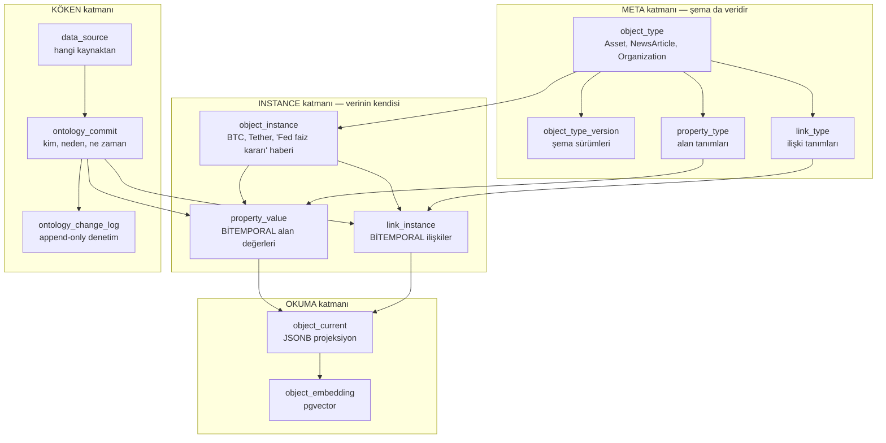

# 02 — Ontoloji

Sistemin çekirdeği. Amaç: **veri modelinin kendisinin de veri olduğu**, her alan değeri
zaman içinde versiyonlanan, kaynağı ve güvenilirliği kayıtlı bir bilgi katmanı.

---

## Neyi ontolojide tutarız, neyi tutmayız

Bu kuralı en başta netleştirmek gerekiyor, çünkü EAV modellerini öldüren şey her zaman
aynı: yüksek frekanslı verinin içeri sızması.

**Ontolojide durur — yavaş değişen gerçekler:**
bir token'ın toplam arzı, unlock takvimi, bir şirketin CEO'su, bir haberin duygu skoru,
bir makro göstergenin aylık değeri, iki varlık arasındaki korelasyon, bir pozisyonun tezi.

**Ontolojide durmaz — yüksek frekanslı zaman serileri:**
OHLCV mumları, tick'ler, order book. Bunlar kendi partition'lı tablolarında yaşar
(bkz. [04-veri-katmani.md](04-veri-katmani.md)). Ontolojideki `Instrument` nesnesi
o tablolara bir `instrument_id` ile bağlanır.

Sezgisel ölçüt: *bir alan günde birden fazla değişiyorsa ontolojiye ait değildir.*

---

## Katmanlar



---

## Versiyonlama modeli

İki zaman ekseni var ve bunları karıştırmamak sistemin en kritik ayrıntısı.

| Eksen | Kolonlar | Sorusu |
|---|---|---|
| **Geçerlilik zamanı** (valid time) | `valid_from`, `valid_to` | *Bu bilgi gerçek dünyada ne zaman doğruydu?* |
| **Kayıt zamanı** (transaction time) | `recorded_at`, `retracted_at` | *Biz bunu ne zaman öğrendik, ne zaman yanlış olduğunu anladık?* |

Neden ikisi birden gerekli? Somut örnek:

> Fed 15 Mart 14:00'te faiz kararını açıklıyor. Bizim haber toplayıcımız 14:03'te görüyor.
> Ertesi gün, kaynağın yanlış rakam yayınladığı anlaşılıyor ve düzeltiliyor.

- `valid_from = 15 Mart 14:00` — kararın gerçek dünyadaki geçerlilik anı
- `recorded_at = 15 Mart 14:03` — bizim öğrendiğimiz an
- `retracted_at = 16 Mart 09:20` — yanlış olduğunu anladığımız an

Backtest 15 Mart 14:01'i simüle ederken bu bilgiyi **görmemeli** (`recorded_at > t`).
14:05'i simüle ederken **görmeli**, üstelik *düzeltilmemiş yanlış hâliyle* — çünkü
sistem o an gerçekten öyle biliyordu. Tek zaman eksenli bir tasarımda bu ayrım kaybolur
ve backtest sistematik olarak gerçekte olduğundan iyi görünür (look-ahead bias).

### Bir alanı güncellemek

`UPDATE` ile değer ezilmez. Tek transaction içinde:

1. Mevcut satırın `valid_to` değeri yeni değerin `valid_from`'una çekilir (kapatma)
2. Yeni değer için yeni satır `INSERT` edilir
3. `ontology_change_log`'a iki kayıt düşer (`CLOSE_PROPERTY`, `SET_PROPERTY`)
4. `object_current` projeksiyonu tazelenir

Eski satır tüm alanlarıyla yerinde durur. `id`'si, `valid_from`'u, `commit_id`'si,
kaynağı ve güven skoru değişmez.

### Datanın tamamını güncellemek

Aynı işlem, tek `ontology_commit` altında tüm alanlar için tekrarlanır. Commit,
atomik değişiklik birimidir — "bu 12 alan aynı anda, aynı sebeple, aynı kaynaktan
değişti" bilgisi korunur.

### Yanlış kaydı geri çekmek

`retracted_at` damgalanır. Satır **silinmez**, sorgulardan düşer. Doğrusu yeni satır
olarak eklenir. "Ne zaman yanlış bilgiyle çalıştık?" sorusu böylece cevaplanabilir kalır.

### Çakışma imkânsızlığı

Bir `EXCLUDE` kısıtı, aynı obje + aynı alan + aynı ordinal için geçerlilik aralıklarının
çakışmasını veritabanı seviyesinde imkânsız kılar. Bu, uygulama hatalarının sessizce
ikili gerçek üretmesini engeller.

---

## Şema (PostgreSQL)

```sql
-- RDS PostgreSQL 16 varsayımıyla
CREATE EXTENSION IF NOT EXISTS btree_gist;   -- EXCLUDE içinde uuid eşitliği için
CREATE EXTENSION IF NOT EXISTS pg_trgm;      -- başlık araması
CREATE EXTENSION IF NOT EXISTS vector;       -- pgvector, semantik arama
-- gen_random_uuid() PostgreSQL 13+ ile çekirdekte gelir
```

### Meta katmanı

```sql
CREATE TABLE object_type (
    id              uuid PRIMARY KEY DEFAULT gen_random_uuid(),
    api_name        text NOT NULL UNIQUE,
    display_name    text NOT NULL,
    description     text,
    icon            text,
    is_abstract     boolean NOT NULL DEFAULT false,
    parent_type_id  uuid REFERENCES object_type(id),   -- kalıtım: Asset -> CryptoAsset
    current_version int  NOT NULL DEFAULT 1,
    created_at      timestamptz NOT NULL DEFAULT now(),
    created_by      text NOT NULL,
    CONSTRAINT object_type_api_name_fmt CHECK (api_name ~ '^[A-Z][A-Za-z0-9]*$')
);

CREATE TABLE object_type_version (
    id             uuid PRIMARY KEY DEFAULT gen_random_uuid(),
    object_type_id uuid NOT NULL REFERENCES object_type(id),
    version        int  NOT NULL,
    status         text NOT NULL CHECK (status IN ('DRAFT','ACTIVE','DEPRECATED')),
    spec           jsonb NOT NULL,         -- o sürümdeki tam şema anlık görüntüsü
    change_note    text,
    valid_from     timestamptz NOT NULL DEFAULT now(),
    valid_to       timestamptz NOT NULL DEFAULT 'infinity',
    created_by     text NOT NULL,
    UNIQUE (object_type_id, version)
);

CREATE TABLE property_type (
    id                    uuid PRIMARY KEY DEFAULT gen_random_uuid(),
    object_type_id        uuid NOT NULL REFERENCES object_type(id),
    api_name              text NOT NULL,
    display_name          text NOT NULL,
    data_type             text NOT NULL CHECK (data_type IN (
                              'STRING','TEXT','INTEGER','DECIMAL','BOOLEAN',
                              'TIMESTAMP','DATE','ENUM','JSON','REFERENCE')),
    cardinality           text NOT NULL DEFAULT 'SINGLE'
                              CHECK (cardinality IN ('SINGLE','LIST')),
    is_required           boolean NOT NULL DEFAULT false,
    is_title              boolean NOT NULL DEFAULT false,
    unit                  text,                    -- 'USD', 'percent', 'BTC'
    constraints           jsonb NOT NULL DEFAULT '{}'::jsonb,  -- min/max/regex/enumValues
    default_value         jsonb,
    introduced_in_version int  NOT NULL DEFAULT 1,
    deprecated_in_version int,
    display_order         int  NOT NULL DEFAULT 0,
    UNIQUE (object_type_id, api_name)
);

CREATE TABLE link_type (
    id                    uuid PRIMARY KEY DEFAULT gen_random_uuid(),
    api_name              text NOT NULL UNIQUE,          -- 'ISSUED_BY'
    display_name          text NOT NULL,
    reverse_api_name      text NOT NULL,                 -- 'ISSUES'
    reverse_display_name  text NOT NULL,
    from_type_id          uuid NOT NULL REFERENCES object_type(id),
    to_type_id            uuid NOT NULL REFERENCES object_type(id),
    cardinality           text NOT NULL CHECK (cardinality IN
                              ('ONE_TO_ONE','ONE_TO_MANY','MANY_TO_MANY')),
    is_symmetric          boolean NOT NULL DEFAULT false,  -- COMPETES_WITH gibi
    property_schema       jsonb NOT NULL DEFAULT '{}'::jsonb,
    introduced_in_version int NOT NULL DEFAULT 1
);
```

### Köken katmanı

```sql
CREATE TABLE data_source (
    id           uuid PRIMARY KEY DEFAULT gen_random_uuid(),
    kind         text NOT NULL CHECK (kind IN (
                     'BINANCE_REST','BINANCE_WS','RSS','NEWS_API','FRED',
                     'COINGECKO','ONCHAIN','LLM_INFERENCE','MANUAL','DERIVED')),
    name         text NOT NULL,
    uri          text,
    fetched_at   timestamptz,
    raw_ref      text,                    -- S3 anahtarı: ham cevabın kopyası
    reliability  numeric(4,3) NOT NULL DEFAULT 0.500
                     CHECK (reliability BETWEEN 0 AND 1),
    metadata     jsonb NOT NULL DEFAULT '{}'::jsonb,
    created_at   timestamptz NOT NULL DEFAULT now()
);

CREATE TABLE ontology_commit (
    id          uuid PRIMARY KEY DEFAULT gen_random_uuid(),
    actor_type  text NOT NULL CHECK (actor_type IN
                    ('HUMAN','INGESTOR','LLM_AGENT','SYSTEM','MIGRATION')),
    actor_id    text NOT NULL,
    reason      text,
    decision_id uuid,                     -- değişiklik bir karardan mı doğdu?
    source_id   uuid REFERENCES data_source(id),
    created_at  timestamptz NOT NULL DEFAULT now()
);

-- Append-only denetim defteri. Uygulama kullanıcısından UPDATE/DELETE yetkisi alınır.
CREATE TABLE ontology_change_log (
    seq              bigint GENERATED ALWAYS AS IDENTITY PRIMARY KEY,
    commit_id        uuid NOT NULL REFERENCES ontology_commit(id),
    op               text NOT NULL CHECK (op IN (
                         'CREATE_OBJECT','SET_PROPERTY','CLOSE_PROPERTY','RETRACT_PROPERTY',
                         'ADD_LINK','CLOSE_LINK','RETRACT_LINK','DELETE_OBJECT',
                         'CREATE_TYPE','ALTER_TYPE')),
    object_id        uuid,
    property_type_id uuid,
    link_type_id     uuid,
    before           jsonb,
    after            jsonb,
    occurred_at      timestamptz NOT NULL DEFAULT now()
);
-- REVOKE UPDATE, DELETE ON ontology_change_log FROM investor_app;
```

### Instance katmanı

```sql
CREATE TABLE object_instance (
    id             uuid PRIMARY KEY DEFAULT gen_random_uuid(),
    object_type_id uuid NOT NULL REFERENCES object_type(id),
    external_id    text NOT NULL,          -- 'BINANCE:BTCUSDT', 'FRED:CPIAUCSL'
    created_at     timestamptz NOT NULL DEFAULT now(),
    created_commit uuid NOT NULL REFERENCES ontology_commit(id),
    deleted_at     timestamptz,            -- soft delete; kayıt asla gitmez
    deleted_commit uuid REFERENCES ontology_commit(id),
    UNIQUE (object_type_id, external_id)
);

-- Ontolojinin kalbi: her alan değeri kendi satırında, bitemporal.
CREATE TABLE property_value (
    id               bigint GENERATED ALWAYS AS IDENTITY PRIMARY KEY,
    object_id        uuid NOT NULL REFERENCES object_instance(id),
    property_type_id uuid NOT NULL REFERENCES property_type(id),
    ordinal          smallint NOT NULL DEFAULT 0,     -- LIST cardinality için

    -- tipli değer kolonları: tam olarak biri dolu olmalı
    value_text       text,
    value_numeric    numeric,
    value_bool       boolean,
    value_ts         timestamptz,
    value_json       jsonb,
    value_ref        uuid REFERENCES object_instance(id),

    -- geçerlilik zamanı
    valid_from       timestamptz NOT NULL,
    valid_to         timestamptz NOT NULL DEFAULT 'infinity',

    -- kayıt zamanı
    recorded_at      timestamptz NOT NULL DEFAULT now(),
    retracted_at     timestamptz,

    -- köken
    commit_id        uuid NOT NULL REFERENCES ontology_commit(id),
    data_source_id   uuid REFERENCES data_source(id),
    confidence       numeric(4,3) CHECK (confidence BETWEEN 0 AND 1),

    CONSTRAINT pv_valid_range CHECK (valid_from < valid_to),
    CONSTRAINT pv_exactly_one_value CHECK (
        (value_text    IS NOT NULL)::int + (value_numeric IS NOT NULL)::int +
        (value_bool    IS NOT NULL)::int + (value_ts      IS NOT NULL)::int +
        (value_json    IS NOT NULL)::int + (value_ref     IS NOT NULL)::int = 1
    )
);

-- Aynı alan için çakışan iki "gerçek" veritabanı seviyesinde imkânsız.
ALTER TABLE property_value ADD CONSTRAINT pv_no_overlapping_truth
    EXCLUDE USING gist (
        object_id        WITH =,
        property_type_id WITH =,
        ordinal          WITH =,
        tstzrange(valid_from, valid_to) WITH &&
    ) WHERE (retracted_at IS NULL);

CREATE INDEX pv_current_idx  ON property_value (object_id, property_type_id)
    WHERE valid_to = 'infinity' AND retracted_at IS NULL;
CREATE INDEX pv_asof_idx     ON property_value USING gist
    (object_id, tstzrange(valid_from, valid_to));
CREATE INDEX pv_recorded_idx ON property_value (recorded_at DESC);
CREATE INDEX pv_commit_idx   ON property_value (commit_id);
CREATE INDEX pv_numeric_idx  ON property_value (property_type_id, value_numeric)
    WHERE value_numeric IS NOT NULL AND retracted_at IS NULL;

CREATE TABLE link_instance (
    id              bigint GENERATED ALWAYS AS IDENTITY PRIMARY KEY,
    link_type_id    uuid NOT NULL REFERENCES link_type(id),
    from_object_id  uuid NOT NULL REFERENCES object_instance(id),
    to_object_id    uuid NOT NULL REFERENCES object_instance(id),
    properties      jsonb NOT NULL DEFAULT '{}'::jsonb,
    weight          numeric,                -- korelasyon, etki gücü vb.
    valid_from      timestamptz NOT NULL,
    valid_to        timestamptz NOT NULL DEFAULT 'infinity',
    recorded_at     timestamptz NOT NULL DEFAULT now(),
    retracted_at    timestamptz,
    commit_id       uuid NOT NULL REFERENCES ontology_commit(id),
    data_source_id  uuid REFERENCES data_source(id),
    confidence      numeric(4,3),
    CONSTRAINT li_valid_range CHECK (valid_from < valid_to)
);

CREATE INDEX li_from_idx ON link_instance (from_object_id, link_type_id)
    WHERE valid_to = 'infinity' AND retracted_at IS NULL;
CREATE INDEX li_to_idx   ON link_instance (to_object_id, link_type_id)
    WHERE valid_to = 'infinity' AND retracted_at IS NULL;
CREATE INDEX li_asof_idx ON link_instance USING gist
    (from_object_id, tstzrange(valid_from, valid_to));
```

### Okuma katmanı (projeksiyon)

```sql
-- Güncel durumun denormalize hâli. Yazma transaction'ıyla aynı anda tazelenir.
CREATE TABLE object_current (
    object_id      uuid PRIMARY KEY REFERENCES object_instance(id),
    object_type_id uuid NOT NULL REFERENCES object_type(id),
    type_api_name  text NOT NULL,
    external_id    text NOT NULL,
    title          text,
    data           jsonb NOT NULL DEFAULT '{}'::jsonb,  -- {"symbol":"BTCUSDT","circulatingSupply":19.8e6}
    link_summary   jsonb NOT NULL DEFAULT '{}'::jsonb,  -- {"ISSUED_BY":[{"id":..,"title":".."}]}
    last_commit_id uuid,
    updated_at     timestamptz NOT NULL DEFAULT now()
);

CREATE INDEX object_current_data_idx  ON object_current USING gin (data jsonb_path_ops);
CREATE INDEX object_current_type_idx  ON object_current (type_api_name);
CREATE INDEX object_current_title_idx ON object_current USING gin (title gin_trgm_ops);

-- Semantik arama ve RAG için
CREATE TABLE object_embedding (
    object_id   uuid PRIMARY KEY REFERENCES object_instance(id),
    model       text NOT NULL,
    embedding   vector(1536) NOT NULL,
    source_text text NOT NULL,
    updated_at  timestamptz NOT NULL DEFAULT now()
);
CREATE INDEX object_embedding_hnsw ON object_embedding
    USING hnsw (embedding vector_cosine_ops);
```

---

## Sorgu desenleri

**Şu anki değer** — normal okuma yolu `object_current`'tan gider:

```sql
SELECT data FROM object_current WHERE type_api_name = 'CryptoAsset' AND external_id = 'BINANCE:BTC';
```

**Belirli bir andaki gerçek** (valid time):

```sql
SELECT pt.api_name, pv.value_numeric, pv.value_text
FROM property_value pv
JOIN property_type pt ON pt.id = pv.property_type_id
WHERE pv.object_id = :objectId
  AND pv.valid_from <= :t AND pv.valid_to > :t
  AND pv.retracted_at IS NULL;
```

**Belirli bir anda BİLDİĞİMİZ** (as-of snapshot — backtest ve karar turu bunu kullanır):

```sql
SELECT pt.api_name, pv.value_numeric, pv.value_text
FROM property_value pv
JOIN property_type pt ON pt.id = pv.property_type_id
WHERE pv.object_id = :objectId
  AND pv.valid_from  <= :t AND pv.valid_to > :t
  AND pv.recorded_at <= :t
  AND (pv.retracted_at IS NULL OR pv.retracted_at > :t);
```

Aradaki tek fark son iki satır — ve sistemin dürüstlüğü tamamen orada duruyor.

**Bir alanın tam geçmişi** (Ontology Explorer'daki zaman çizelgesi):

```sql
SELECT pv.valid_from, pv.valid_to, pv.recorded_at, pv.retracted_at,
       pv.value_numeric, pv.value_text, pv.confidence,
       c.actor_type, c.actor_id, c.reason, ds.name AS source
FROM property_value pv
JOIN ontology_commit c   ON c.id  = pv.commit_id
LEFT JOIN data_source ds ON ds.id = pv.data_source_id
WHERE pv.object_id = :objectId AND pv.property_type_id = :propertyTypeId
ORDER BY pv.valid_from DESC, pv.recorded_at DESC;
```

**İlişki üzerinden gezinme** (n-hop, recursive CTE ile):

```sql
WITH RECURSIVE walk AS (
    SELECT l.to_object_id AS id, 1 AS depth
    FROM link_instance l
    WHERE l.from_object_id = :startId AND l.link_type_id = ANY(:linkTypes)
      AND l.valid_to = 'infinity' AND l.retracted_at IS NULL
  UNION
    SELECT l.to_object_id, w.depth + 1
    FROM walk w
    JOIN link_instance l ON l.from_object_id = w.id
    WHERE w.depth < :maxDepth AND l.link_type_id = ANY(:linkTypes)
      AND l.valid_to = 'infinity' AND l.retracted_at IS NULL
)
SELECT DISTINCT oc.* FROM walk w JOIN object_current oc ON oc.object_id = w.id;
```

3–4 hop'a kadar bu yeterli. Daha derin graph analizi gerekirse ADR-0001'deki
tekrar değerlendirme koşullarına bakılır.

---

## Java API

```java
public interface OntologyStore {

    // --- yazma (hepsi CommitContext altında, transaction-scoped) ---
    ObjectRef create(String typeApiName, String externalId, CommitContext ctx);

    void setProperty(ObjectRef obj, String propertyApiName, Value value,
                     Instant validFrom, CommitContext ctx);

    void setProperties(ObjectRef obj, Map<String, Value> values,
                       Instant validFrom, CommitContext ctx);

    void retractProperty(ObjectRef obj, String propertyApiName,
                         Instant retractedAt, CommitContext ctx);

    void link(ObjectRef from, String linkApiName, ObjectRef to,
              LinkProperties props, Instant validFrom, CommitContext ctx);

    void unlink(ObjectRef from, String linkApiName, ObjectRef to,
                Instant validTo, CommitContext ctx);

    // --- okuma ---
    ObjectView current(ObjectRef obj);
    ObjectView asOf(ObjectRef obj, Instant knowledgeTime);
    List<PropertyHistoryEntry> history(ObjectRef obj, String propertyApiName);
    List<ObjectView> query(OntologyQuery q);

    /** Analiz turu ve backtest için: bilgi zamanına sabitlenmiş değişmez görünüm. */
    OntologySnapshot snapshot(Instant knowledgeTime);
}

public record CommitContext(
    ActorType actorType,     // HUMAN | INGESTOR | LLM_AGENT | SYSTEM
    String    actorId,
    String    reason,
    UUID      decisionId,    // nullable
    UUID      dataSourceId,  // nullable
    Double    confidence     // nullable
) {}
```

`OntologySnapshot` kritik bileşen: bir kez alınır, tur boyunca değişmez, ve **canlı
sistemle backtest arasındaki tek fark onu hangi `knowledgeTime` ile aldığındır.**
Analiz ajanları `OntologyStore`'a değil, `OntologySnapshot`'a bağımlıdır — bu kural
derleme zamanında modül sınırıyla zorlanır.

### Dinamik sorgu DSL'i

Frontend şemayı çalışma zamanında öğrendiği için sabit endpoint yazamayız.
Tek bir `POST /api/ontology/query` uç noktası, JSON sorgu alır ve SQL'e derler:

```json
{
  "type": "CryptoAsset",
  "where": [
    { "field": "marketCapUsd", "op": "gt",  "value": 1000000000 },
    { "field": "category",     "op": "in",  "value": ["L1", "L2"] }
  ],
  "traverse": [
    { "link": "ISSUED_BY", "as": "issuer", "select": ["name", "country"] }
  ],
  "orderBy": [{ "field": "marketCapUsd", "dir": "desc" }],
  "asOf": "2026-08-01T00:00:00Z",
  "limit": 50
}
```

`asOf` yoksa `object_current` üzerinden (hızlı yol), varsa `property_value` üzerinden
(tarihsel yol) derlenir. Derleyici sadece beyaz listedeki operatörleri üretir ve tüm
değerleri parametre olarak bağlar — string birleştirme yok.

---

## Şema evrimi

Ontoloji dinamik, ama disiplinsiz değil. Tip değişikliği kuralları:

| Değişiklik | Sürüm | Politika |
|---|---|---|
| Yeni opsiyonel alan | minor | Serbest. Eski objelerde alan yok, `null` döner. |
| Yeni zorunlu alan | major | `default_value` zorunlu, ya da zorunluluk sadece yeni objelere uygulanır. |
| Alan silme | major | Fiziksel silme yok. `deprecated_in_version` damgalanır; veri durur, UI'da gizlenir. |
| Tip daraltma (DECIMAL → INTEGER) | major | Yeni alan aç, dönüşümü commit'le yaz, eskisini deprecate et. |
| Yeni ilişki türü | minor | Serbest. |
| Kalıtım değişikliği | major | Manuel gözden geçirme gerektirir. |

Her değişiklik `object_type_version`'a yeni bir satır ve `ontology_change_log`'a bir
kayıt düşürür. Şemanın kendisi de böylece versiyonlanmış olur.

---

## Başlangıç ontolojisi

Faz-1'de tanımlanacak tipler:

| Tip | Açıklama | Örnek alanlar |
|---|---|---|
| `Asset` *(abstract)* | Varlık üst tipi | `name`, `symbol`, `category` |
| `CryptoAsset` | `Asset` alt tipi | `circulatingSupply`, `maxSupply`, `unlockSchedule`, `tvlUsd`, `githubCommits30d` |
| `Equity` | `Asset` alt tipi (ileride) | `peRatio`, `revenueGrowth`, `sector` |
| `Instrument` | İşlem çifti | `exchangeSymbol`, `tickSize`, `minNotional`, `instrumentId` |
| `Exchange` | Borsa | `name`, `jurisdiction`, `makerFee`, `takerFee` |
| `Organization` | Şirket / proje / vakıf | `name`, `country`, `foundedAt` |
| `Person` | Kurucu, yönetici | `name`, `role` |
| `NewsArticle` | Haber | `title`, `body`, `publishedAt`, `sentiment`, `materiality` |
| `MacroIndicator` | Gösterge tanımı | `code`, `frequency`, `unit` |
| `MacroObservation` | Bir göstergenin bir tarihteki değeri | `value`, `periodEnd`, `isRevision` |
| `MarketRegime` | Rejim etiketi | `label` (RISK_ON/RISK_OFF/CHOP), `confidence` |
| `Position` | Açık/kapalı pozisyon | `side`, `size`, `avgEntry`, `status` |
| `DecisionRef` | Kararın ontoloji aynası | `decisionId`, `verdict` |
| `Lesson` | Çıkarılan ders | `statement`, `scope`, `evidenceCount` |
| `Playbook` | Strateji kural seti | `version`, `rules`, `status` |

Örnek ilişkiler:

```
Instrument  -TRADES_ON->      Exchange
Instrument  -BASE_ASSET->     Asset
Asset       -ISSUED_BY->      Organization
Person      -FOUNDED->        Organization
NewsArticle -MENTIONS->       Asset | Organization | Person
NewsArticle -IMPACTS->        Asset          (weight = etki gücü)
Asset       -COMPETES_WITH->  Asset          (simetrik)
Asset       -CORRELATES_WITH->Asset          (weight = korelasyon; zamanla değişir)
MacroObservation -OF->        MacroIndicator
DecisionRef -ABOUT->          Instrument
Lesson      -DERIVED_FROM->   DecisionRef
```

Kardinalite kaynak ve hedef taraflarını ayrı ayrı sınırlar. `Instrument -TRADES_ON-> Exchange`
bir `MANY_TO_ONE`'dır: bir enstrüman tek borsada işlem görür, bir borsada çok enstrüman
bulunur. Yeni bir bağ kurulurken sınırlı taraftaki mevcut açık bağ **kapatılır**, silinmez —
"mart ayında hangi borsadaydı" sorusu cevaplanabilir kalır.

`CORRELATES_WITH` bitemporal ilişkinin neden değerli olduğunun iyi bir örneği:
BTC–NASDAQ korelasyonu 2022'de 0.7, 2024'te 0.2 idi. İkisini de saklıyoruz; bir kararı
denetlerken "o gün hangi korelasyonu varsayıyorduk" sorusu cevaplanabiliyor.

---

## Performans notları

- `property_value` büyümesi tamamen "yavaş değişen gerçekler" kuralına bağlı.
  50 varlık × 30 alan × ayda 2 değişim ≈ yılda 36 bin satır. Sorun yok.
  Haber nesneleri baskın kalem olacak (günde ~500 haber × 6 alan ≈ yılda 1.1M satır) —
  yine rahat.
- Okumaların ezici çoğunluğu `object_current` üzerinden gider; EAV join'i sadece
  tarihsel sorgular ve denetim ekranları için ödenir.
- `OntologySnapshot` tur başına bir kez materyalize edilir ve Redis'te turun ömrü
  boyunca cache'lenir; ajanların tekrar tekrar DB'ye gitmesi engellenir.
- Haber nesneleri için 18 ay sonra arşivleme politikası: `property_value` satırları
  S3'e Parquet olarak taşınır, DB'de sadece `object_current` özeti kalır.
