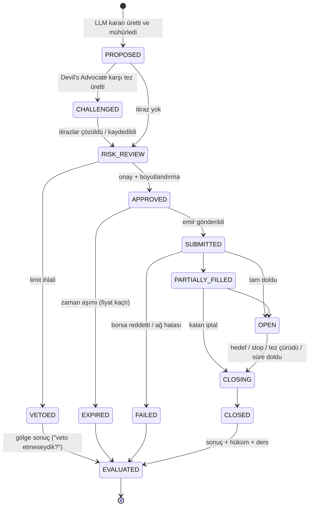

# 03 — Decision Engine

Her kararın tam yaşam döngüsünü yöneten modül: **ne zaman alındı, neden alındı,
hangi kanıtlara dayandı, güven skoru neydi, kim itiraz etti, ne oldu, doğru muydu,
bundan ne öğrendik.**

---

## Temel ilke: karar önce mühürlenir, sonra uygulanır

Bir karar `PROPOSED` durumuna geçtiği anda şu alanlar yazılır ve **bir daha asla
değişmez**: tez, kanıtlar, güven skoru, niyet (giriş/stop/hedef/boyut), çürütme
koşulları ve kararın dayandığı bilgi zamanı.

Bu bir tercih değil, veritabanı seviyesinde zorlanan bir kısıt. Sebebi şu: LLM'ler
sonucu gördükten sonra son derece ikna edici gerekçeler üretmekte çok iyidir. Mühür
olmadan sistemin "öğrendiği" şey, gerçekte olan değil, sonradan uydurulan hikâyedir.

Mühür, `seal_hash` ile de doğrulanır: kararın mühürlü alanlarının SHA-256 özeti.
Denetim sırasında yeniden hesaplanıp karşılaştırılabilir.

---

## Yaşam döngüsü



Geçişler `decision_event` tablosuna append-only yazılır. Durum makinesi elle yazılmış,
açık bir izinli-geçiş haritasıdır (Spring Statemachine gerekmiyor); izinsiz geçiş
denemesi exception fırlatır.

**`VETOED` ve `NO_ACTION` de değerlendirilir.** Sadece uygulanan kararlardan öğrenmek,
sisteme sağkalım yanlılığı (survivorship bias) enjekte eder. Veto edilen kararın
"gölge sonucu" (veto etmeseydik ne olurdu) izlenir; bu, risk limitlerinin zamanla
kalibre edilmesini sağlayan tek geri besleme kaynağıdır. Aynı şekilde "işlem yapma"
kararı da bir karardır ve sonucu ölçülür.

---

## Şema

```sql
CREATE TABLE decision (
    id                     uuid PRIMARY KEY DEFAULT gen_random_uuid(),
    correlation_id         uuid NOT NULL,        -- aynı analiz turundan doğanlar
    parent_decision_id     uuid REFERENCES decision(id),
    status                 text NOT NULL CHECK (status IN (
                              'PROPOSED','CHALLENGED','RISK_REVIEW','VETOED','APPROVED',
                              'SUBMITTED','PARTIALLY_FILLED','OPEN','CLOSING','CLOSED',
                              'EVALUATED','EXPIRED','FAILED')),
    kind                   text NOT NULL CHECK (kind IN
                              ('ENTRY','ADD','REDUCE','EXIT','HEDGE','NO_ACTION')),
    instrument_object_id   uuid NOT NULL REFERENCES object_instance(id),

    -- ============ NE ZAMAN ============
    proposed_at            timestamptz NOT NULL DEFAULT now(),
    risk_reviewed_at       timestamptz,
    approved_at            timestamptz,
    submitted_at           timestamptz,
    opened_at              timestamptz,
    closed_at              timestamptz,
    evaluated_at           timestamptz,
    expires_at             timestamptz NOT NULL,   -- bu süreden sonra karar geçersiz

    -- ============ NİYET (mühürlü) ============
    side                   text CHECK (side IN ('BUY','SELL')),
    intent                 jsonb NOT NULL,
    invalidation           jsonb NOT NULL,         -- tezi ne çürütür?
    horizon                interval NOT NULL,

    -- ============ GÜVEN ============
    confidence             numeric(4,3) NOT NULL CHECK (confidence BETWEEN 0 AND 1),
    calibrated_confidence  numeric(4,3),           -- geçmiş isabete göre düzeltilmiş
    expected_value_pct     numeric,
    risk_reward_ratio      numeric,

    -- ============ NEDEN (mühürlü) ============
    thesis                 text NOT NULL,          -- tam gerekçe
    thesis_summary         text NOT NULL,          -- tek cümle

    -- ============ İZLENEBİLİRLİK (mühürlü) ============
    model_id               text NOT NULL,
    prompt_version         text NOT NULL,
    playbook_version       text NOT NULL,
    risk_config_version    text NOT NULL,
    knowledge_time         timestamptz NOT NULL,   -- hangi bilgi durumuyla karar verildi
    snapshot_hash          text NOT NULL,          -- replay doğrulaması
    seal_hash              text NOT NULL,

    -- ============ NE OLDU ============
    outcome                jsonb,
    thesis_confirmed       boolean,
    verdict                text CHECK (verdict IN
                              ('CORRECT','LUCKY','UNLUCKY','WRONG','INCONCLUSIVE')),
    lesson_id              uuid,

    -- ============ MALİYET ============
    llm_tokens_in          int,
    llm_tokens_out         int,
    llm_cost_usd           numeric(10,6)
);

CREATE INDEX decision_status_idx      ON decision (status)
    WHERE status NOT IN ('EVALUATED','VETOED','EXPIRED');
CREATE INDEX decision_instrument_idx  ON decision (instrument_object_id, proposed_at DESC);
CREATE INDEX decision_correlation_idx ON decision (correlation_id);
CREATE INDEX decision_verdict_idx     ON decision (verdict, confidence)
    WHERE verdict IS NOT NULL;
```

### Mühür koruması

```sql
CREATE OR REPLACE FUNCTION decision_seal_guard() RETURNS trigger AS $$
BEGIN
    IF NEW.intent         IS DISTINCT FROM OLD.intent
    OR NEW.invalidation   IS DISTINCT FROM OLD.invalidation
    OR NEW.thesis         IS DISTINCT FROM OLD.thesis
    OR NEW.confidence     IS DISTINCT FROM OLD.confidence
    OR NEW.knowledge_time IS DISTINCT FROM OLD.knowledge_time
    OR NEW.snapshot_hash  IS DISTINCT FROM OLD.snapshot_hash
    OR NEW.seal_hash      IS DISTINCT FROM OLD.seal_hash
    OR NEW.proposed_at    IS DISTINCT FROM OLD.proposed_at THEN
        RAISE EXCEPTION 'Mühürlü karar alanı değiştirilemez (decision %)', OLD.id;
    END IF;
    RETURN NEW;
END $$ LANGUAGE plpgsql;

CREATE TRIGGER decision_seal_guard_trg
    BEFORE UPDATE ON decision
    FOR EACH ROW EXECUTE FUNCTION decision_seal_guard();
```

### Kanıtlar — "gerekçe neydi" sorusunun cevabı

```sql
CREATE TABLE decision_evidence (
    id               bigint GENERATED ALWAYS AS IDENTITY PRIMARY KEY,
    decision_id      uuid NOT NULL REFERENCES decision(id),
    agent            text NOT NULL,      -- TECHNICAL_ANALYST, NEWS_ANALYST, ...
    kind             text NOT NULL CHECK (kind IN (
                        'TECHNICAL','FUNDAMENTAL','NEWS','MACRO','ONCHAIN','MEMORY','REGIME')),
    direction        text NOT NULL CHECK (direction IN ('SUPPORTS','CONTRADICTS','NEUTRAL')),
    weight           numeric(4,3) NOT NULL CHECK (weight BETWEEN 0 AND 1),
    claim            text NOT NULL,      -- "RSI(14)=28, son 90 günün en düşük bölgesi"
    object_id        uuid REFERENCES object_instance(id),   -- ontolojideki kaynak
    property_ref     text,                                   -- hangi alan
    observed_value   jsonb,
    data_source_id   uuid REFERENCES data_source(id),
    agent_confidence numeric(4,3),
    created_at       timestamptz NOT NULL DEFAULT now()
);

CREATE INDEX de_decision_idx ON decision_evidence (decision_id);
CREATE INDEX de_kind_idx     ON decision_evidence (kind, direction);
```

Her kanıt ontolojideki kaynağına geri işaret eder. Decision Inspector'da bir kanıta
tıklayınca ham veriye kadar inilebilmesinin sebebi bu.

### İtirazlar

```sql
CREATE TABLE decision_challenge (
    id           bigint GENERATED ALWAYS AS IDENTITY PRIMARY KEY,
    decision_id  uuid NOT NULL REFERENCES decision(id),
    challenger   text NOT NULL CHECK (challenger IN
                     ('DEVILS_ADVOCATE','RISK_ENGINE','MEMORY','HUMAN')),
    severity     text NOT NULL CHECK (severity IN ('INFO','WARNING','BLOCKING')),
    objection    text NOT NULL,
    resolution   text,
    resolved     boolean NOT NULL DEFAULT false,
    created_at   timestamptz NOT NULL DEFAULT now()
);
```

`BLOCKING` bir itiraz çözülmeden karar `RISK_REVIEW`'a geçemez.

### Olay defteri, karar ilişkileri

```sql
CREATE TABLE decision_event (
    seq          bigint GENERATED ALWAYS AS IDENTITY PRIMARY KEY,
    decision_id  uuid NOT NULL REFERENCES decision(id),
    event_type   text NOT NULL,
    from_status  text,
    to_status    text,
    payload      jsonb NOT NULL DEFAULT '{}'::jsonb,
    actor        text NOT NULL,
    occurred_at  timestamptz NOT NULL DEFAULT now()
);
CREATE INDEX devt_decision_idx ON decision_event (decision_id, seq);
-- REVOKE UPDATE, DELETE ON decision_event FROM investor_app;

CREATE TABLE decision_link (
    from_decision_id uuid NOT NULL REFERENCES decision(id),
    to_decision_id   uuid NOT NULL REFERENCES decision(id),
    relation         text NOT NULL CHECK (relation IN
                        ('SUPERSEDES','CLOSES','HEDGES','REVISES','CONTRADICTS')),
    note             text,
    PRIMARY KEY (from_decision_id, to_decision_id, relation)
);
```

---

## `intent` ve `invalidation` yapısı

```json
{
  "intent": {
    "sizePctOfEquity": 2.5,
    "entryType": "LIMIT",
    "entryPrice": 67400.00,
    "stopLoss": 65800.00,
    "takeProfit": [
      { "price": 69900.00, "portion": 0.5 },
      { "price": 72500.00, "portion": 0.5 }
    ],
    "maxSlippageBps": 15,
    "timeInForce": "GTC"
  },
  "invalidation": [
    { "type": "PRICE_BELOW",  "value": 65800, "action": "EXIT",
      "note": "yapısal destek kırılırsa tez geçersiz" },
    { "type": "TIME_STOP",    "within": "PT12H", "action": "EXIT",
      "note": "12 saatte hareket başlamazsa katalizör yoktu demektir" },
    { "type": "THESIS_EVENT", "within": "P2D", "action": "REVIEW",
      "description": "ETF net akışı pozitife dönmezse tezin dayanağı yok" },
    { "type": "REGIME_CHANGE","to": "RISK_OFF", "action": "EXIT" }
  ]
}
```

`invalidation` bu tasarımın en değerli parçası. LLM'e "bu kararı ne çürütür?" diye
sormak iki iş birden yapar: (1) tezi zorlar, gevşek gerekçeleri açığa çıkarır,
(2) sonuç değerlendirmesini **otomatikleştirilebilir** hale getirir. `PRICE_BELOW`,
`TIME_STOP` ve `REGIME_CHANGE` deterministik olarak kontrol edilir; `THESIS_EVENT`
kapanışta LLM'e sorulur.

---

## `outcome` yapısı

```json
{
  "entryPrice": 67412.30,
  "exitPrice": 69880.00,
  "quantity": 0.00741,
  "grossPnlUsd": 18.29,
  "feesUsd": 0.71,
  "netPnlUsd": 17.58,
  "pnlPct": 3.52,
  "mae": -1.12,
  "mfe": 4.21,
  "holdingPeriod": "PT6H12M",
  "exitReason": "TARGET_HIT",
  "slippageBps": 4.2,
  "benchmarkPnlPct": 1.10,
  "invalidationsTriggered": []
}
```

- **MAE / MFE** (max adverse / favorable excursion): pozisyon en fazla ne kadar zarara
  ve ne kadar kâra gitti. Stop'un fazla dar mı, hedefin fazla uzak mı olduğunu bunlar söyler.
- **benchmarkPnlPct**: aynı dönemde sadece elde tutsaydık ne olurdu. Bu olmadan
  "kazandık" ifadesi anlamsız.

---

## Hüküm (verdict) — kâr ile haklılığı ayırmak

Sistemin öğrenme kalitesini belirleyen tek en önemli ayrım. PnL tek başına gürültüdür;
sistem sadece PnL'den öğrenirse gürültüyü öğrenir.

| | **Tez doğrulandı** | **Tez çürüdü** |
|---|---|---|
| **PnL +** | `CORRECT` — tekrarla | `LUCKY` — tekrarlama, şanstı |
| **PnL −** | `UNLUCKY` — süreç doğru, sonuç kötü | `WRONG` — süreci düzelt |

Öğrenme ağırlıkları: `CORRECT` ve `WRONG` yüksek sinyal taşır. `LUCKY` ve `UNLUCKY`,
insanların da sistemlerin de en çok yanlış ders çıkardığı iki kutudur — bunlar
`learning` modülünde ayrı işlenir ve kanıt ağırlıklarını güncellemede düşük katsayı alır.

`thesis_confirmed` alanı `invalidation` kontrollerinden ve kapanışta LLM'e sorulan
tek soruyla belirlenir: *"Kararın orijinal tezi — sonucu bilmeden, sadece o dönemde
gerçekleşen olaylara bakarak — doğrulandı mı?"* Bu soru sorulurken LLM'e PnL
**gösterilmez**.

---

## Kalibrasyon

```sql
CREATE TABLE calibration_snapshot (
    id              uuid PRIMARY KEY DEFAULT gen_random_uuid(),
    computed_at     timestamptz NOT NULL DEFAULT now(),
    window_from     timestamptz NOT NULL,
    window_to       timestamptz NOT NULL,
    scope           text NOT NULL,   -- 'GLOBAL' | 'AGENT:NEWS_ANALYST' | 'REGIME:RISK_OFF'
    sample_size     int  NOT NULL,
    brier_score     numeric(6,5),
    log_loss        numeric(8,5),
    buckets         jsonb NOT NULL,  -- [{lo,hi,n,declaredAvg,realizedRate}]
    calibration_map jsonb NOT NULL   -- beyan edilen güven -> düzeltilmiş güven
);

CREATE TABLE evidence_effectiveness (
    kind         text NOT NULL,
    regime       text NOT NULL DEFAULT 'ALL',
    window_from  timestamptz NOT NULL,
    window_to    timestamptz NOT NULL,
    n            int NOT NULL,
    hit_rate     numeric(5,4),
    avg_pnl_pct  numeric,
    lift         numeric,          -- bu kanıt varken vs yokken isabet farkı
    PRIMARY KEY (kind, regime, window_from)
);
```

**Brier skoru** = `mean((confidence − thesisConfirmed)²)`. 0'a yakın iyi, 0.25 rastgele.
Sistemin birincil sağlık göstergesi bu; PnL değil.

**Reliability diagram**: güven skorları %10'luk kovalara bölünür, her kovada beyan
edilen ortalama güven ile gerçekleşen isabet oranı karşılaştırılır. Frontend'de
`Calibration` ekranında çizilir.

**`calibration_map`** basit ve yorumlanabilir tutulur: kova bazlı eşleme
(izotonik regresyona gerek yok, örneklem küçükken zaten aşırı uyum yapar).
En az 100 kapanmış karar biriktikten sonra `calibrated_confidence` üretilmeye başlar;
öncesinde `NULL` kalır ve risk motoru ham `confidence`'a en muhafazakâr katsayıyı uygular.

---

## Java modeli

```java
public sealed interface DecisionCommand {
    record Propose(UUID correlationId, InstrumentRef instrument, DecisionKind kind,
                   Intent intent, List<Invalidation> invalidation, double confidence,
                   String thesis, String thesisSummary, List<Evidence> evidence,
                   ModelProvenance provenance, Instant knowledgeTime) implements DecisionCommand {}
    record Challenge(UUID decisionId, List<Objection> objections)  implements DecisionCommand {}
    record RiskReview(UUID decisionId, RiskVerdict verdict)        implements DecisionCommand {}
    record RecordFill(UUID decisionId, Fill fill)                  implements DecisionCommand {}
    record Close(UUID decisionId, ExitReason reason, Instant at)   implements DecisionCommand {}
    record Evaluate(UUID decisionId, Outcome outcome,
                    boolean thesisConfirmed)                       implements DecisionCommand {}
}

@Service
public class DecisionEngine {
    /** Mühürler, kanıtları yazar, PROPOSED olayını yayınlar. Tek transaction. */
    public UUID propose(DecisionCommand.Propose cmd);

    /** İzinli geçiş haritasına göre durumu ilerletir; ihlalde exception. */
    public void apply(DecisionCommand cmd);

    /** Kapanan kararı değerlendirir: invalidation kontrolleri + LLM tez hükmü + verdict. */
    public Verdict evaluate(UUID decisionId);
}
```

`propose` tek bir transaction'da çalışır: `decision` + `decision_evidence` +
`decision_event` birlikte yazılır ya da hiçbiri yazılmaz. Mühürlenmemiş bir karar
sistemde hiçbir zaman var olmaz.

---

## Ontolojiyle ilişkisi

Kararlar kendi tablolarında yaşar (yüksek yapılı ve sık sorgulanan veri; EAV'a uygun
değil). Ama her karar ontolojide bir `DecisionRef` nesnesiyle aynalanır ve
`DecisionRef -ABOUT-> Instrument` ilişkisiyle bağlanır.

Bunun getirisi: ontoloji sorgularında kararlar birinci sınıf vatandaş olur.
*"BTC hakkında son 30 günde verilen, güveni %70'in üstünde olan ve tezi çürüyen
kararlar"* tek bir ontoloji sorgusuyla çıkar; `MemoryAnalyst` ajanının yaptığı iş budur.
