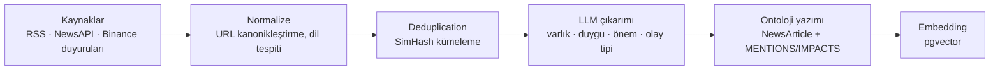

# 04 — Veri Katmanı

Ontoloji "yavaş değişen gerçekler" içindir. Bu doküman, ontolojiye girmeyen yüksek
frekanslı piyasa verisini ve ontolojiyi besleyen ingest hatlarını anlatır.

---

## Piyasa verisi

### Neyi saklıyoruz, neyi saklamıyoruz

| Veri | Karar | Gerekçe |
|---|---|---|
| OHLCV (1m taban + rollup'lar) | **Kalıcı sakla** | Tüm teknik analizin girdisi |
| Funding rate, open interest | **Kalıcı sakla** | Düşük hacim, yüksek sinyal |
| Ham tick geçmişi | **Saklama** | Yılda ~200 GB; karar döngümüz 15m, kullanımı yok |
| Order book anlık görüntüsü | **Sadece canlı buffer** | Emir anındaki spread/likidite kontrolü için gerekli, geçmişi değil |

Tick geçmişini saklamamak bilinçli bir karar: LLM tabanlı bir sistemde karar döngüsü
saniyeler sürer, tick seviyesinde tepki veremez. Emir gönderirken gereken canlı
spread/derinlik bilgisi Redis'te 30 saniyelik pencerede tutulur, diske yazılmaz.

### Şema

```sql
CREATE TABLE instrument (
    id            bigint GENERATED ALWAYS AS IDENTITY PRIMARY KEY,
    object_id     uuid NOT NULL UNIQUE REFERENCES object_instance(id),  -- ontoloji bağı
    exchange      text NOT NULL,
    symbol        text NOT NULL,
    base_asset    text NOT NULL,
    quote_asset   text NOT NULL,
    status        text NOT NULL,          -- TRADING | HALT | DELISTED
    tick_size     numeric(20,10) NOT NULL,
    step_size     numeric(20,10) NOT NULL,
    min_notional  numeric(20,8)  NOT NULL,
    UNIQUE (exchange, symbol)
);

CREATE TABLE ohlcv (
    instrument_id   bigint        NOT NULL REFERENCES instrument(id),
    tf              text          NOT NULL,   -- '1m','5m','15m','1h','4h','1d'
    open_time       timestamptz   NOT NULL,
    close_time      timestamptz   NOT NULL,
    open            numeric(20,8) NOT NULL,
    high            numeric(20,8) NOT NULL,
    low             numeric(20,8) NOT NULL,
    close           numeric(20,8) NOT NULL,
    volume          numeric(30,8) NOT NULL,
    quote_volume    numeric(30,8) NOT NULL,
    trade_count     integer       NOT NULL,
    taker_buy_base  numeric(30,8),
    is_final        boolean       NOT NULL DEFAULT false,
    ingested_at     timestamptz   NOT NULL DEFAULT now(),
    PRIMARY KEY (instrument_id, tf, open_time)
) PARTITION BY RANGE (open_time);

CREATE TABLE derivative_metric (
    instrument_id  bigint      NOT NULL REFERENCES instrument(id),
    metric         text        NOT NULL,      -- FUNDING_RATE | OPEN_INTEREST | LONG_SHORT_RATIO
    observed_at    timestamptz NOT NULL,
    value          numeric(30,10) NOT NULL,
    PRIMARY KEY (instrument_id, metric, observed_at)
) PARTITION BY RANGE (observed_at);
```

### Partition yönetimi (TimescaleDB olmadan)

Plan başlangıçta `pg_partman` öngörüyordu. Gerçeklemede bundan vazgeçildi: eklentinin
hedef RDS sürümünde bulunacağı garanti değil ve build'i doğrulanmamış bir eklentiye
bağlamak istemedik. Aylık partition'ları kendimiz açıyoruz — toplam ~30 satır SQL:

```sql
CREATE OR REPLACE FUNCTION ensure_month_partition(p_parent text, p_month date)
RETURNS text LANGUAGE plpgsql AS $$
DECLARE
    v_start date := date_trunc('month', p_month)::date;
    v_end   date := (date_trunc('month', p_month) + interval '1 month')::date;
    v_name  text := format('%s_%s', p_parent, to_char(v_start, 'YYYY_MM'));
BEGIN
    IF p_parent NOT IN ('ohlcv', 'derivative_metric') THEN
        RAISE EXCEPTION 'Bilinmeyen partition ebeveyni: %', p_parent;
    END IF;
    IF to_regclass(quote_ident(v_name)) IS NULL THEN
        EXECUTE format('CREATE TABLE %I PARTITION OF %I FOR VALUES FROM (%L) TO (%L)',
                       v_name, p_parent, v_start, v_end);
    END IF;
    RETURN v_name;
END; $$;
```

İki ayrıntı önemli:

- **Ebeveyn adı beyaz listede.** Fonksiyon dinamik SQL üretiyor; tablo adının parametreden
  gelmesi, denetlenmediği takdirde enjeksiyon yüzeyidir.
- **DEFAULT partition yok.** Olsaydı aralık dışı bir yazma sessizce oraya düşer ve
  sonradan taşınması gerekirdi. Hata vermesi daha iyi — ama önlenebilir bir hata olduğu
  için yazma yolu, dokunacağı ayların partition'larını önden açıyor.

Bakım işi Spring `@Scheduled` ile günlük koşar ve önümüzdeki üç ayı hazırlar.

Saklama politikası ve arşivleme henüz yazılmadı. Planlanan: 24 aydan eski 1m verisi
S3'e Parquet olarak yazılır. Backtest'in daha geriye
gitmesi gerekirse oradan geri yüklenir. 5m ve üstü zaman dilimleri hacimce küçük
olduğu için süresiz saklanır.

### Rollup — 1m'den üst zaman dilimleri

TimescaleDB'nin `continuous aggregate`'i olmadığı için bu işi kendimiz yaparız.
Mum kapanışında tetiklenir, idempotenttir:

```sql
INSERT INTO ohlcv (instrument_id, tf, open_time, close_time,
                   open, high, low, close,
                   volume, quote_volume, trade_count, taker_buy_base, is_final)
SELECT
    instrument_id,
    :targetTf,
    :bucketStart,
    :bucketEnd,
    (array_agg(open  ORDER BY open_time ASC ))[1],
    max(high),
    min(low),
    (array_agg(close ORDER BY open_time DESC))[1],
    sum(volume), sum(quote_volume), sum(trade_count), sum(taker_buy_base),
    true
FROM ohlcv
WHERE tf = '1m'
  AND instrument_id = :instrumentId
  AND open_time >= :bucketStart
  AND open_time <  :bucketEnd
  AND is_final = true
GROUP BY instrument_id
HAVING count(*) = :expectedBars          -- eksik mum varsa hiç yazma
ON CONFLICT (instrument_id, tf, open_time) DO UPDATE SET
    high = EXCLUDED.high, low = EXCLUDED.low, close = EXCLUDED.close,
    volume = EXCLUDED.volume, quote_volume = EXCLUDED.quote_volume,
    trade_count = EXCLUDED.trade_count, is_final = EXCLUDED.is_final;
```

`HAVING count(*) = :expectedBars` satırı önemli: eksik 1m mumdan üretilmiş bir 15m mum,
sessizce yanlış indikatör üretir. Eksikse rollup yazılmaz, boşluk doldurma job'ı
tetiklenir ve bir sonraki turda tekrar denenir.

### Ingest ilerleme işareti

`ingest_watermark` tablosu enstrüman × zaman dilimi başına son başarılı mumu, son deneme
zamanını ve üst üste kaç hata alındığını tutar. İki işi var: backfill'in kaldığı yerden
devam etmesi, ve "bu kaynağın verisi ne kadar taze" sorusunun cevaplanabilmesi.

İşaret geriye gitmez (`GREATEST` ile güncellenir): geçmiş bir aralığın backfill'i,
ilerlemeyi geri alıp aynı veriyi tekrar tekrar çekmeye yol açmasın.

### `is_final` — sessiz look-ahead hatası kaynağı

Binance WebSocket kline akışı kapanmamış mumu da yayınlar (`k.x = false`).
Kapanmamış mumdan hesaplanan indikatör, mum kapanınca değişir — backtest'te bu
"geleceği görmek" demektir.

**Kural:** karar üretimi için kullanılan tüm indikatörler yalnızca `is_final = true`
mumlardan hesaplanır.

Bu kural `MarketDataReader` arayüzünde iki şekilde zorlanıyor:

1. **Kapanmamış mum döndüren metot yok.** Her sorgu `is_final` filtresini taşır; canlı
   mum ayrı bir arayüzde yaşayacak ve analiz modülüne kapalı olacak (Faz 5).
2. **Zaman sınırı zorunlu.** "Son 200 mumu ver" diyen bir imza, backtest sırasında
   sessizce geleceğe uzanır. `lastFinalBars(instrument, timeframe, count, asOf)`
   imzasında `asOf` isteğe bağlı değil — unutulamaz.

```java
List<Bar> finalBars(InstrumentRef i, Timeframe tf, Instant fromInclusive, Instant toExclusive);
List<Bar> lastFinalBars(InstrumentRef i, Timeframe tf, int count, Instant asOf);
Optional<Bar> finalBarAt(InstrumentRef i, Timeframe tf, Instant openTime);
List<Gap> findGaps(InstrumentRef i, Timeframe tf, Instant from, Instant to);
Freshness freshness(InstrumentRef i, Timeframe tf, Instant asOf);
```

### Boşluk doldurma

```sql
SELECT gs AS missing_open_time
FROM generate_series(:from, :to, interval '1 minute') gs
LEFT JOIN ohlcv o
       ON o.open_time = gs AND o.instrument_id = :instrumentId AND o.tf = '1m'
WHERE o.open_time IS NULL;
```

5 dakikada bir koşar; bulunan boşluklar Binance REST `/api/v3/klines` ile doldurulur.
WebSocket kopmaları, deploy'lar ve borsa bakımları bu şekilde kapatılır.

### Canlı buffer (Redis) — Faz 5'e ertelendi

Aşağıdaki tasarım emir gönderme yolu için gerekli; o katman yazılana kadar Redis
bağımlılığı eklenmedi.


| Anahtar | Tip | İçerik | TTL |
|---|---|---|---|
| `md:price:{symbol}` | string | son işlem fiyatı | 60 sn |
| `md:book:{symbol}` | hash | en iyi alış/satış, 10 kademe derinlik | 10 sn |
| `md:trades:{symbol}` | stream | son ~5000 işlem (MAXLEN) | — |
| `md:bar:{symbol}:1m` | hash | kapanmamış mum | 120 sn |

Emir göndermeden hemen önce `md:book` okunur: spread eşiği aşılmışsa veya derinlik
emri karşılamaya yetmiyorsa emir gönderilmez (bkz. [06](06-risk-ve-execution.md)).

---

## Haber hattı



### Deduplication neden kritik

Aynı haber 5 kaynaktan gelirse, dedup yapılmadığında sistem bunu "5 ayrı kanıt" olarak
görür ve haberin önemini yayın hacmiyle karıştırır. Bu, haber odaklı stratejilerdeki
en yaygın sistematik hatadır.

Çözüm: başlık + ilk paragraf üzerinden SimHash, Hamming mesafesi eşiğiyle kümeleme.
Küme başına **tek** `NewsArticle` nesnesi oluşturulur; diğer kaynaklar aynı nesneye
ek `data_source` kaydı olarak bağlanır. Kaynak sayısı ayrı bir alan olarak tutulur
(`sourceCount`) — kanıt ağırlığında kullanılabilir ama kanıt sayısını çoğaltmaz.

### Çıkarım

Çıkarım bir portun arkasında: `NewsExtractor`. Faz 2'de kural tabanlı bir varsayılan
kullanılıyor — hattın LLM olmadan da uçtan uca çalışması, ingest'in doğruluğunu (zaman
damgaları, tekilleştirme, ontoloji yazımı) model kalitesinden bağımsız test etmeyi
sağlıyor. Kural tabanlı çıkarımın üretebileceği önem skoru bilinçli olarak düşük tavanlı;
zayıf bir çıkarımın yüksek güvenle konuşması kalibrasyonu baştan bozardı.

Faz 3'te LangChain4j üzerinden LLM gerçeklemesi bunun yerini alacak
([ADR-0008](adr/0008-langchain4j.md)). Beklenen çıktı biçimi:

```json
{
  "entities":    [{ "externalId": "BINANCE:BTC", "role": "SUBJECT" }],
  "eventType":   "REGULATORY",
  "sentiment":   -0.4,
  "materiality": 0.8,
  "timeHorizon": "DAYS",
  "summary":     "SEC, spot ETF onay kararını 45 gün erteledi.",
  "isSpeculation": false
}
```

`materiality` (önem) ile `sentiment` (yön) ayrı tutulur. "Çok olumsuz ama önemsiz"
bir haber ile "hafif olumsuz ama çok önemli" bir haber farklı ağırlık taşımalıdır.

### Zaman damgaları

```
valid_from  = haberin yayın zamanı (publishedAt)
recorded_at = bizim topladığımız zaman (fetchedAt)
```

İkisi arasında dakikalar, bazen saatler olur. Backtest `recorded_at`'e bakar —
yani sistem o an gerçekten haberi görmüş müydü sorusuna. Bu, haber odaklı
backtest'lerin gerçekçi olmasını sağlayan tek mekanizma.

---

## Makro ve on-chain

| Kaynak | Seriler | Sıklık |
|---|---|---|
| FRED | `FEDFUNDS`, `DFF`, `CPIAUCSL`, `DGS10`, `DTWEXBGS`, `M2SL`, `UNRATE` | günlük yenileme |
| CoinGecko | toplam piyasa değeri, BTC dominance, stablecoin arzı | saatlik |
| Binance | funding rate, open interest, long/short oranı | 15 dk |
| DefiLlama | TVL (protokol ve zincir bazlı) | saatlik |
| On-chain (opsiyonel, Faz-3) | borsa net akışı, aktif adres, balina transferleri | saatlik |

### Revizyonlar — bitemporal modelin karşılığını verdiği yer

Makro veriler revize edilir. Temmuz CPI'ı 15 Ağustos'ta 314.2 olarak yayınlanır,
15 Eylül'de 314.5'e düzeltilir. Bir kararı denetlerken "o gün hangi CPI rakamını
görüyorduk" sorusunun cevabı, revize edilmiş değer değil **o gün yayında olan değer**
olmalıdır.

FRED'in (ALFRED) `realtime_start` / `realtime_end` alanları tam olarak bunu veriyor ve
ontolojinin geçerlilik aralığına birebir oturuyor:

| FRED | Ontoloji | Anlamı |
|---|---|---|
| `realtime_start` | `valid_from` | Bu rakamın resmî rakam olmaya başladığı an |
| `realtime_end` | `valid_to` | Hangi ana kadar resmî kaldığı (`9999-12-31` = hâlâ) |
| `date` | `period` alanı | Gözlemin etiketlendiği dönem (değişmez) |

Yani geçerlilik ekseni "bu rakam ne zaman *resmî rakamdı*" sorusunu taşıyor. Revizyon
eskisini ezmez, kapatır.

**Kayıt zamanı da yayın zamanına ayarlanır.** Bir makro rakam yayınlandığı anda dünyaya
açılır; onu ne zaman çektiğimiz bilgi durumunu değiştirmez. Geriye dönük yüklenen on
yıllık bir seri, bu olmadan geçmiş sorgularda hiç görünmezdi — `recorded_at` bugün olurdu.
`CommitContext.withRecordedAt()` bu beyanı açık hale getiriyor; yanlış kullanıldığında
geçmişi olduğundan bilgili gösterebileceği için `ontology_commit.created_at` her zaman
gerçek yazma anını tutar ve fark denetlenebilir kalır.

### Ekonomik takvim

`MacroEvent` nesneleri (FOMC toplantısı, CPI yayını, ETF karar tarihi) ileri tarihli
olarak ontolojiye yazılır. Risk motoru bunu kullanır: yüksek etkili bir olayın
öncesindeki pencerede yeni pozisyon açılmaz, mevcut pozisyonlar küçültülür.
Bu deterministik bir kuraldır, LLM'in takdirine bırakılmaz.

---

## Ingest güvenilirliği

- **Idempotency.** Tüm ingest yazımları `ON CONFLICT DO UPDATE` ile idempotent.
  Aynı mumun/haberin iki kez işlenmesi çift kayıt üretmez.
- **Devre kesici.** Her dış kaynak Resilience4j circuit breaker arkasında. Bir kaynak
  düşerse karar turu, o kaynağın verisinin "bayat" olduğu bilgisiyle çalışır —
  sessizce eski veriyi taze sanmaz. `OntologySnapshot` her kaynak için `freshness`
  bilgisi taşır; bir kaynak eşiğin üstünde bayatsa ilgili ajan `abstain` eder.
- **Ham veri kopyası.** Her dış cevabın ham hâli S3'e yazılır (`data_source.raw_ref`).
  Parse hatası bulunduğunda geçmiş yeniden işlenebilir.
- **Rate limit.** Binance ağırlık (weight) bütçesi Redis'te sayılır; bütçenin %80'i
  aşılınca ingest yavaşlatılır, emir gönderme yolu için rezerv ayrılır. Emir gönderme
  hiçbir zaman veri toplama yüzünden rate limit'e takılmaz.
