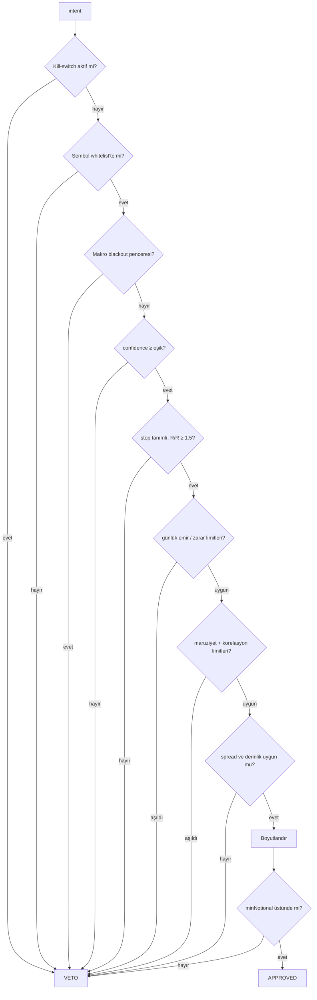
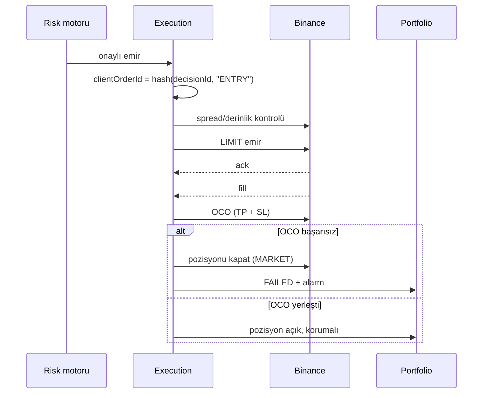

# 06 — Risk ve Execution

Faz-1'de gerçek parayla, Binance Spot'ta işlem yapılacak. Bu doküman sermayeyi koruyan
katmanları tanımlar. **Buradaki kurallar LLM'in takdirine bırakılmaz; hepsi deterministik
Java kodudur ve test edilir.**

---

## Neden risk katmanı LLM değil

LLM'in üç başarısızlık modu var ve üçü de sessizdir: halüsinasyon, prompt injection,
model regresyonu. Üçünde de LLM son derece kendinden emin görünür.

Bu yüzden mimari şu garantiyi verir: **LLM emir gönderemez.** Ürettiği şey bir
`intent`'tir. Onu deterministik kod değerlendirir, limitlere karşı kontrol eder,
boyutlandırır, veto eder. En kötü senaryoda — tamamen ele geçirilmiş bir LLM —
üretebileceği maksimum zarar, limitler içinde kalan kötü bir işlemdir.

---

## Sermaye zarfı

En dış savunma, koda değil hesaba yazılıdır: **borsada, kaybedilmesi göze alınandan
fazla para bulunmaz.**

```yaml
capital:
  envelopeUsdt: 500          # borsadaki toplam bakiye tavanı
  reserveRatio: 0.30         # nakitte kalması gereken asgari oran
```

Kâr biriktikçe zarf otomatik büyümez; büyütmek açık bir insan kararıdır. Zarfın
üstündeki bakiye periyodik olarak çekilir (manuel — API'nin çekme yetkisi yok).

### Borsa API anahtarı

| Ayar | Değer | Neden |
|---|---|---|
| **Withdraw yetkisi** | **KAPALI** | Anahtar sızsa bile para dışarı çıkamaz. Tek en önemli önlem. |
| IP whitelist | Zorunlu | Anahtar sadece uygulama sunucusundan çalışır |
| Spot trading | Açık | |
| Futures / Margin | **KAPALI** | Faz-1'de kaldıraç yok |
| Saklama | AWS Secrets Manager | Kodda, ortam dosyasında veya logda asla bulunmaz |

Anahtar 90 günde bir döndürülür.

---

## Risk limitleri

```yaml
risk:
  version: "2026.08.1"          # karara yazılır — hangi limitlerle karar verildi

  # pozisyon
  maxPositionPctOfEquity: 10        # tek pozisyon en fazla özkaynağın %10'u
  maxRiskPerTradePct: 1.0           # tek işlemde riske atılan en fazla %1
  maxTotalExposurePct: 60           # toplam açık pozisyon en fazla %60
  maxConcurrentPositions: 3
  maxCorrelatedExposurePct: 25      # korelasyonu >0.7 olanlar tek pozisyon sayılır

  # zarar
  maxDailyLossPct: 3.0              # aşılırsa kill-switch
  maxWeeklyLossPct: 7.0             # aşılırsa manuel inceleme olmadan açılmaz
  maxDrawdownPct: 15.0              # zirveden düşüş; aşılırsa tam durdurma

  # işlem hijyeni
  maxDailyOrders: 20
  maxSpreadBps: 8                   # spread bunu aşarsa emir yok
  minDepthMultiple: 5               # kitapta emrin 5 katı derinlik olmalı
  maxSlippageBps: 15
  minHoldingPeriod: PT15M           # aşırı işlem (overtrading) freni

  # karar kalitesi
  minConfidence: 0.60
  minRiskRewardRatio: 1.5
  requireStopLoss: true             # stop'suz emir kabul edilmez

  # takvim
  macroBlackout: PT2H               # yüksek etkili olay öncesi yeni pozisyon yok

  symbolWhitelist: [BTCUSDT, ETHUSDT, SOLUSDT, BNBUSDT]
```

`risk.version` her karara yazılır. "Bu kararı hangi limitlerle verdik" sorusu denetimde
cevaplanabilir olmalı; limitler zamanla değişecek.

### Limit kontrol sırası



Her veto sebebiyle birlikte `decision_challenge` tablosuna `RISK_ENGINE` kaydı düşer.

---

## Pozisyon boyutlandırma

Sabit oran değil, **risk tabanlı**: pozisyon büyüklüğünü stop mesafesi belirler.

```java
// Riske atılan tutar sabit; stop uzaksa pozisyon küçülür.
BigDecimal riskAmount    = equity.multiply(maxRiskPerTradePct).divide(HUNDRED);
BigDecimal stopDistPct   = entryPrice.subtract(stopPrice).abs()
                                     .divide(entryPrice, MC).multiply(HUNDRED);
BigDecimal notional      = riskAmount.divide(stopDistPct, MC).multiply(HUNDRED);

// Güven ölçekleme — kalibrasyon oluşana kadar en muhafazakâr katsayı
BigDecimal confFactor    = calibration.isEstablished()
                             ? scale(decision.calibratedConfidence())   // 0.5 – 1.0
                             : MIN_CONFIDENCE_FACTOR;                   // 0.5

notional = notional.multiply(confFactor)
                   .min(equity.multiply(maxPositionPctOfEquity).divide(HUNDRED))
                   .min(remainingExposureBudget());

BigDecimal qty = notional.divide(entryPrice, MC)
                         .setScale(stepScale, RoundingMode.DOWN);   // her zaman AŞAĞI
```

Üç kural:

1. **Tüm para hesapları `BigDecimal`.** `double` kullanılmaz — ne fiyatta, ne miktarda,
   ne PnL'de. Bu bir stil tercihi değil; kayan nokta hatası borsada reddedilen emre
   ve yanlış PnL'e dönüşür.
2. **Miktar her zaman aşağı yuvarlanır** (`step_size`), fiyat `tick_size`'a hizalanır.
   Reddedilen emirlerin en yaygın sebebi budur.
3. **Kelly kriteri kullanılmaz** — en az 100 kapanmış karar ve oturmuş kalibrasyon
   olmadan Kelly, örneklem gürültüsünü kaldıraca çevirir. Kalibrasyon oturduktan sonra
   en fazla ¼-Kelly, üstelik `maxRiskPerTradePct` tavanına tabi olarak değerlendirilir.

---

## Kill-switch

### Tetikleyiciler (otomatik)

| Tetikleyici | Eşik |
|---|---|
| Günlük zarar | `maxDailyLossPct` aşıldı |
| Toplam düşüş (drawdown) | `maxDrawdownPct` aşıldı |
| Reconciliation uyuşmazlığı | tolerans dışı fark |
| Borsa API hata oranı | 5 dakikada >%20 |
| Kritik veri bayatlığı | fiyat akışı >2 dk sessiz |
| LLM maliyeti | günlük tavan aşıldı |

Ayrıca UI'da her ekranın üstünde duran manuel bir düğme.

### Kill-switch ne yapar

1. Tüm bekleyen emirleri iptal eder
2. Yeni karar üretimini durdurur
3. Alarm gönderir (e-posta + push)
4. **Açık pozisyonları kapatmaz** — borsadaki stop emirleri yerinde kalır

Son madde bilinçli. Günlük zarar limitine takılmak çoğu zaman piyasanın dip yaptığı
ana denk gelir; otomatik panik satışı, korunmaya çalışılan zararı gerçekleştirmenin
en hızlı yoludur. Pozisyonları tamamen kapatmak (`PANIC`) ayrı ve **manuel** bir
düğmedir.

Kill-switch'ten çıkış her zaman manueldir.

---

## Emir yürütme

### Stop borsada durur, botta değil

Kritik kural: pozisyon açıldıktan **hemen sonra** koruyucu stop emri borsaya gönderilir.
Bot çökerse, sunucu yeniden başlarsa, ağ giderse — stop yerinde kalır.

Binance Spot'ta OCO (One-Cancels-Other) ile kâr al ve zarar durdur tek emirde
gönderilir. OCO gönderimi başarısız olursa pozisyon **derhal kapatılır**; korumasız
pozisyon taşınmaz.



Giriş emri `entryTimeout` (varsayılan 10 dk) içinde dolmazsa iptal edilir ve karar
`EXPIRED` olur. Kaçan fiyatın peşinden koşulmaz.

### Idempotency

```java
String clientOrderId = "d" + Base62.encode(
    sha256(decisionId.toString() + ":" + legNo)).substring(0, 20);
```

Deterministik. Ağ hatası sonrası retry aynı `clientOrderId` ile gider; Binance ikinci
emri `DUPLICATE_ORDER` ile reddeder. Çift pozisyon açılması mimari olarak imkânsız.

### Reconciliation

60 saniyede bir borsadaki gerçek durum ile iç defter karşılaştırılır:

- Açık emirler: `clientOrderId` bazında tam eşleşme
- Bakiyeler: toz (dust) toleransı dışında tam eşleşme
- Pozisyonlar: miktar ve ortalama giriş

Uyuşmazlıkta sistem `HALT` durumuna geçer ve alarm verir. **Otomatik düzeltme yapılmaz** —
iç defterin borsaya körü körüne uydurulması, gerçek bir hatayı örtmenin en kolay yolu.
Uyuşmazlık insan tarafından incelenir.

### Ücretler ve kayma

- Maker/taker ücretleri `Exchange` nesnesinden okunur, PnL'e dahil edilir
- Gerçekleşen kayma (`slippageBps`) her fill'de ölçülüp `outcome`'a yazılır
- Ortalama kayma eşiği aşarsa emir tipi stratejisi gözden geçirilir — bu, sistemin
  kendi işlem kalitesini izleme mekanizması

---

## `ExchangePort` — ileride hisse eklenebilmesi için

Borsaya özgü hiçbir şey `execution` modülünün dışına sızmaz.

```java
public interface ExchangePort {
    ExchangeCapabilities capabilities();
    List<InstrumentSpec>  instruments();
    AccountSnapshot       account();

    OrderAck   submit(OrderRequest request);     // clientOrderId ile idempotent
    void       cancel(String clientOrderId);
    List<Order> openOrders();
    List<Fill>  fillsSince(Instant since);

    Flux<MarketEvent> marketStream(Set<String> symbols);
}

public record ExchangeCapabilities(
    boolean supportsOco,
    boolean supportsMarketOrders,
    boolean supportsShort,
    TradingCalendar calendar,      // 7/24 mü, seans saatleri mi
    Settlement settlement,         // T+0 (kripto) | T+2 (hisse)
    Set<OrderType> orderTypes
) {}
```

Hisse senedi eklendiğinde değişen tek şey yeni bir adapter ve `ExchangeCapabilities`
üzerinden farklılıkların bildirilmesi: seans saatleri, T+2 takas, açığa satış kısıtı,
farklı `tick_size` kuralları. Risk motoru ve decision engine bu farkları
`capabilities()` üzerinden okur; borsa adı hiçbir yerde `if` içine girmez.

---

## Canlı sermaye kapıları

Küçük sermaye ile canlı işlem seçildi. Sermayenin canlıya çıkması için aşağıdaki
kapıların **hepsi** geçilmiş olmalı. Bunlar sırayla açılır; hiçbiri atlanmaz.

| # | Kapı | Ölçüt |
|---|---|---|
| 1 | Testnet doğrulaması | Binance Testnet'te 100+ emir, sıfır tutarsızlık |
| 2 | Reconciliation | 7 gün kesintisiz, sıfır uyuşmazlık |
| 3 | Kill-switch tatbikatı | Her tetikleyici testte doğrulandı, gerçek ortamda bir kez elle denendi |
| 4 | Stop güvencesi | Uygulama zorla öldürüldüğünde borsadaki stop'un yerinde kaldığı gözlendi |
| 5 | Shadow modu | 14 gün / 50+ karar; sıfır limit ihlali |
| 6 | Anahtar hijyeni | Withdraw kapalı, IP whitelist aktif, Secrets Manager'da |
| 7 | Zarf | Borsadaki bakiye ≤ `envelopeUsdt`, kaybı göze alınabilir |
| 8 | Gözlemlenebilirlik | PnL, maruziyet, limit kullanımı, LLM maliyeti canlı dashboard'da |

### Her deploy için shadow kapısı

Yukarıdaki kapılar bir kez geçilir. Bunun **üstüne**, `analysis`, `decision-engine`
veya `risk` modüllerine dokunan **her** deploy, canlıya çıkmadan önce shadow modda
koşar: kararlar üretilir, kaydedilir, risk motorundan geçirilir — ama emir gönderilmez.

Karşılaştırılan metrikler: veto oranı, güven dağılımı, sanal PnL, limit ihlali sayısı.
Shadow'da **tek bir limit ihlali** deploy'u durdurur.

Süre: 72 saat veya 30 karar (hangisi önce dolarsa).

---

## Sağlık metrikleri

| Metrik | Alarm eşiği |
|---|---|
| Günlük PnL | `maxDailyLossPct`'in %70'i |
| Toplam maruziyet | limitin %90'ı |
| Reconciliation gecikmesi | >90 sn |
| Emir reddi oranı | 1 saatte >%5 |
| Ortalama kayma | >10 bps |
| Veri bayatlığı (fiyat) | >120 sn |
| Karar turu süresi | >90 sn |
| Günlük LLM maliyeti | bütçenin %80'i |
| Açık `BLOCKING` itiraz | >0 |

Hepsi Prometheus'a yazılır, Grafana'da tek bir "Sistem Sağlığı" panelinde toplanır.
