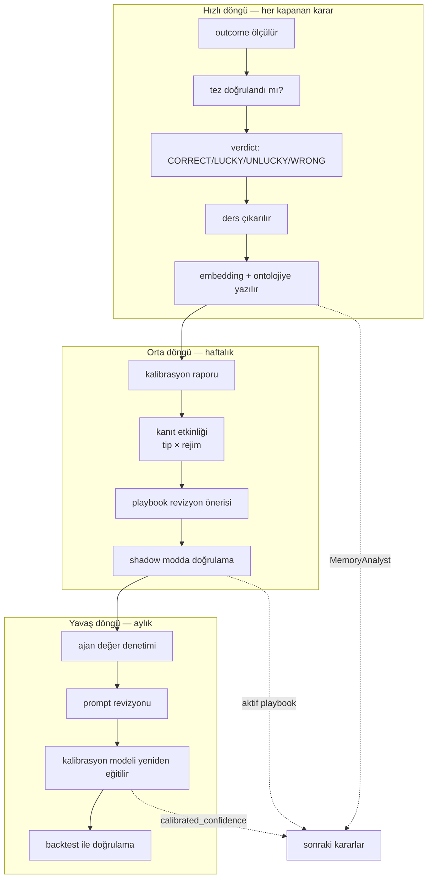

# 07 — Sürekli Öğrenme

"Sürekli öğrenme" burada model eğitimi anlamına gelmiyor. LLM tabanlı bir karar
sisteminde öğrenmenin neredeyse tamamı üç şeyden ibaret: **hafıza, kalibrasyon ve
kuralların evrimi.** Üçü de gradient descent gerektirmez — bu, "sadece Java" kararının
neden gerçek bir kısıt olmadığının cevabı.

---

## Üç döngü



---

## Hızlı döngü — episodik hafıza

Her karar kapandığında (`CLOSED` → `EVALUATED`):

1. **Sonuç ölçülür.** PnL, MAE, MFE, tutma süresi, kayma, benchmark farkı.
2. **Tez değerlendirilir.** `invalidation` koşulları deterministik kontrol edilir;
   niteliksel olanlar için LLM'e tek soru sorulur — **PnL gösterilmeden**:
   *"Bu kararın orijinal tezi, o dönemde gerçekleşen olaylara bakarak doğrulandı mı?"*
3. **Hüküm verilir.** `CORRECT` / `LUCKY` / `UNLUCKY` / `WRONG` (bkz. [03](03-decision-engine.md)).
4. **Ders çıkarılır** — ama her karardan değil (aşağıya bakınız).

### Ders (Lesson) yapısı

```json
{
  "statement": "RISK_OFF rejiminde, materiality<0.7 olan haberlere dayanan BUY kararları tutmuyor.",
  "scope": { "evidenceKind": "NEWS", "regime": "RISK_OFF", "side": "BUY", "instrument": null },
  "supportingDecisions": ["...", "..."],
  "n": 14,
  "hitRate": 0.29,
  "baselineHitRate": 0.52,
  "status": "PROPOSED",
  "validFrom": "2026-08-24T00:00:00Z",
  "reviewAt": "2026-11-24T00:00:00Z"
}
```

Dersler ontolojide `Lesson` nesnesi olarak yaşar. Bu, bitemporal modelin karşılığını
verdiği bir başka nokta: bir ders sonradan çürütülürse (`REFUTED`) kaydı silinmez,
kapatılır. *"Bu dersi ne zaman doğru sandık, ne zaman vazgeçtik?"* sorusu cevaplanabilir
kalır — bir öğrenme sisteminin kendi öğrenme geçmişini denetleyebilmesi gerekir.

### Tek karardan ders çıkarılmaz

Kritik kısıt. Tek bir işlemden ders çıkarmak, gürültüyü kural sanmaktır — insanların
ve otomatik sistemlerin en yaygın hatası.

Bir ders `PROPOSED` olabilmek için:
- Aynı kalıpta **en az 12 kapanmış karar** olmalı
- Kalıbın isabet oranı temel orandan (baseline) anlamlı ölçüde sapmalı
- Kalıp en az **iki farklı piyasa rejiminde** veya en az 30 günlük bir pencereye
  yayılmış olmalı

`ACTIVE` olabilmek için ayrıca örneklem dışı doğrulama gerekir: ders T anına kadarki
veriden önerilir, T sonrası kararlarda test edilir. Geçmezse `REFUTED` olur.

### Hafızanın geri çağrılması

`MemoryAnalyst` bir sonraki karar turunda iki yoldan arar:

- **Yapısal filtre:** aynı sembol, aynı rejim, benzer kanıt bileşimi (SQL)
- **Semantik arama:** mevcut durumun özeti → embedding → `object_embedding` üzerinde
  kosinüs benzerliği (pgvector, HNSW)

Getirilen dersler ve benzer geçmiş kararlar `MEMORY` tipinde kanıt olarak sunulur.
Önemlisi: geçmişin **kaybettiren** örnekleri de getirilir. Sadece başarıları hatırlayan
bir hafıza, sistemi cesaretlendirmekten başka bir şey yapmaz.

---

## Orta döngü — kalibrasyon ve playbook

### Kalibrasyon raporu (haftalık)

| Ölçü | Anlamı |
|---|---|
| Brier skoru | `mean((confidence − thesisConfirmed)²)` — 0 mükemmel, 0.25 rastgele |
| Reliability diagram | %10'luk kovalarda beyan edilen güven vs gerçekleşen isabet |
| Aşırı güven sapması | Ortalama güven − ortalama isabet. Pozitifse sistem kendini fazla beğeniyor. |
| Ayrım gücü | Yüksek güvenli kararlar gerçekten daha mı iyi sonuçlanıyor? |

Çıktı `calibration_snapshot` tablosuna yazılır ve `calibrated_confidence` üretiminde
kullanılır. En az 100 kapanmış karar olmadan kalibrasyon haritası üretilmez; öncesinde
risk motoru en muhafazakâr güven katsayısını uygular.

**Ayrım gücü, Brier'den daha önemli olabilir.** Sistematik olarak aşırı güvenli ama
sıralaması doğru olan bir sistem düzeltilebilir (harita kaydırılır); güveni ile sonucu
arasında hiç ilişki olmayan bir sistem düzeltilemez — yeniden tasarlanması gerekir.

### Kanıt etkinliği

`evidence_effectiveness` tablosu, kanıt tipi × rejim kırılımında şunu ölçer:
*bu tip kanıt karara dahil olduğunda isabet artıyor mu?*

Örnek bir bulgu: `ONCHAIN` kanıtları `RISK_ON` rejiminde +%8 lift veriyor, `RISK_OFF`'ta
−%3. Bu, `PortfolioManager`'ın playbook'una rejime bağlı bir ağırlık kuralı olarak girer.

**Çoklu hipotez tuzağı:** 8 kanıt tipi × 3 rejim = 24 kombinasyon test ediliyor.
Tamamen rastgele veriyle bile 1–2 tanesi "anlamlı" çıkar. Bu yüzden bulguların
`ACTIVE` olması için örneklem dışı doğrulama zorunlu ve minimum örneklem eşiği
kombinasyon başına 25 karar.

### Playbook evrimi

Playbook, `PortfolioManager`'ın uyduğu açık kural setidir — versiyonlanmış, okunabilir
bir doküman:

```markdown
## playbook v7
1. RISK_OFF rejiminde yeni long pozisyon için minimum güven 0.75 (normalde 0.60).
2. Tek bir kanıt tipine dayanan kararlarda maksimum pozisyon %5 (normalde %10).
3. materiality<0.7 olan haber kanıtı tek başına giriş gerekçesi olamaz.  ← Lesson-42'den
4. Aynı sembolde 24 saat içinde ikinci giriş, ilkinin tezi hâlâ geçerliyse yapılabilir.
```

Haftalık döngüde LLM'e toplu istatistikler verilir ve revizyon önerisi istenir.
Öneri **doğrudan uygulanmaz**:

```
öneri → DRAFT → shadow modda 14 gün → kalibrasyon karşılaştırması → ACTIVE veya RETIRED
```

Playbook sürümü her karara yazılır (`playbook_version`), böylece hangi kural setinin
hangi sonucu ürettiği geriye dönük ölçülebilir.

---

## Yavaş döngü — yapısal değişiklik

### Ajan değer denetimi

Her ajan kendi varlığını kanıtlamak zorunda. Aylık olarak sorulan soru:
*bu ajanın kanıtları çıkarıldığında karar kalitesi düşüyor mu?*

Ölçüm, kapanmış kararlar üzerinde geriye dönük yapılır: ajanın kanıtları olan ve
olmayan alt kümelerde isabet oranı karşılaştırılır. Katkısı ölçülemeyen bir ajan
önce ucuz modele indirilir, sonra kaldırılır. Bu hem maliyeti hem gürültüyü düşürür.

### Kalibrasyon modeli

Basit, yorumlanabilir bir istatistiksel model: kanıt özelliklerinden (tip dağılımı,
ağırlık toplamı, çelişki oranı, rejim, ajan sayısı) `P(tez doğrulanır)` tahmini.
Java tarafında **Tribuo** ile lojistik regresyon yeterli.

Amaç LLM'in yerini almak değil — LLM'in beyan ettiği güveni düzeltmek. Model çıktısı
ile LLM güveni ayrıştığında bu bir sinyaldir ve `decision_challenge`'a `INFO` seviyesinde
kaydedilir.

Örneklem 300 kapanmış kararı geçene kadar bu model üretime alınmaz; öncesinde kova
tabanlı basit kalibrasyon haritası kullanılır.

### Prompt revizyonu

Prompt değişiklikleri kod değişiklikleridir: PR, gözden geçirme, shadow modu.
Aylık döngüde, kalibrasyonu bozan veya sık `abstain` üreten ajanların promptları
gözden geçirilir.

---

## Backtest — tek kod yolu

"Sadece Java" kararının en somut getirisi burada.

`BacktestRunner`, bir zaman aralığını adım adım ilerletir ve her adımda
`ontologyStore.snapshot(t)` çağırır. Sonra **canlı sistemin çağırdığı aynı**
`DecisionEngine`, aynı ajanlar, aynı risk motoru koşar. Değişen tek bileşen
`ExchangePort`: yerine `SimulatedExchange` geçer — OHLCV'den dolum, modellenmiş
kayma ve ücretlerle.

Python sidecar'lı mimarilerde klasik felaket, backtest'teki strateji kodu ile
prod'daki kodun zamanla ayrışmasıdır. Burada ayrışacak iki kod yok.

### İki mod

| Mod | LLM çağrısı | Ne için |
|---|---|---|
| **Replay** | Kaydedilmiş çıktılar tekrar oynatılır | Risk motoru, boyutlandırma, execution değişikliklerini bedelsiz test etmek |
| **Fresh** | Yeni LLM çağrısı yapılır | Prompt veya playbook değişikliklerini test etmek — pahalı, seyrek kullanılır |

Replay modu, "aynı kararlarla daha sıkı bir stop kullansaydık ne olurdu?" sorusunu
saniyeler içinde ve sıfır LLM maliyetiyle cevaplar. Günlük kullanılan mod bu.

### Look-ahead savunması

Backtest'in dürüstlüğü üç mekanizmaya dayanıyor, ve üçü de canlı sistemde de aktif:

1. `OntologySnapshot` yalnızca `recorded_at <= t` olan bilgiyi döndürür
2. İndikatörler yalnızca `is_final = true` mumlardan hesaplanır
3. Haber ve makro verisi yayın zamanına değil, **bizim öğrendiğimiz** zamana göre filtrelenir

Bu üçü olmadan üretilen her backtest sonucu, gerçekte olduğundan iyi görünür.

---

## İzlenen metrikler

| Metrik | Hedef yön | Neden |
|---|---|---|
| Brier skoru | ↓ | Birincil sağlık göstergesi |
| Aşırı güven sapması | → 0 | Sistem kendini tanıyor mu |
| Ayrım gücü | ↑ | Güven skorunun bilgi taşıyıp taşımadığı |
| `CORRECT` oranı | ↑ | Süreç kalitesi |
| `LUCKY` / `CORRECT` oranı | ↓ | Şansa bağımlılık |
| Ders çürütme oranı | → düşük | Aşırı uyum göstergesi |
| Ajan `abstain` oranı | dengeli | 0 ise gürültü, çok yüksekse faydasız |
| Sharpe, max drawdown | ↑ / ↓ | Ancak yukarıdakiler sağlıklıysa anlamlı |

Sıralama kasıtlı. Kalibre olmamış bir sistemin pozitif getirisi ölçüm değil, kumardır.
