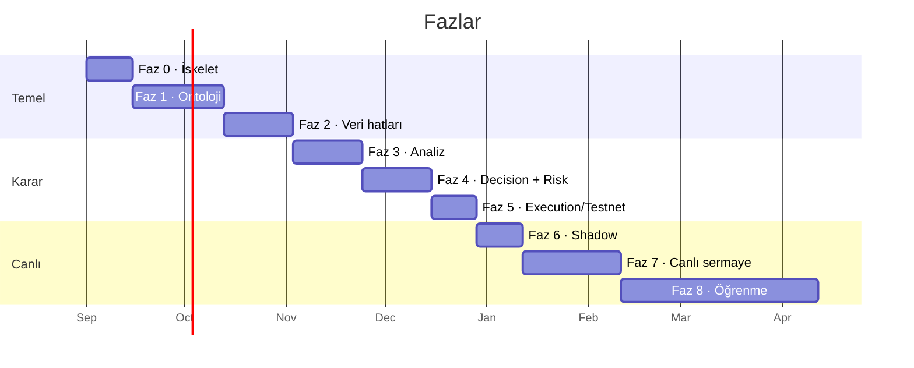
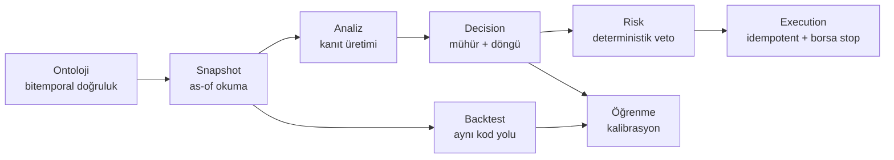

# 10 — Yol Haritası

Süreler tek geliştirici, tam zamanlı olmayan bir tempo varsayımıyla. Fazlar arası
**kapılar** atlanmaz — özellikle canlı sermayeye giden yoldakiler.

---

## Faz 0 — İskelet · ~2 hafta

Gradle çok modüllü yapı, Spring Boot + Modulith, Flyway, Testcontainers, jOOQ kod
üretimi. Vite + React iskeleti, OpenAPI istemci üretimi. Docker Compose ile yerel
Postgres + Redis. Terraform ile RDS ve Secrets Manager. GitHub Actions.

**Kapı:** Boş bir uçtan uca akış çalışıyor — frontend bir REST çağrısı yapıyor, backend
Postgres'e yazıyor, Testcontainers testi CI'da yeşil.

## Faz 1 — Ontoloji çekirdeği · ~4 hafta

Meta katman, instance katmanı, bitemporal yazma/okuma, commit modeli, `EXCLUDE`
kısıtı, `object_current` projeksiyonu, `OntologyStore` API'si, `OntologySnapshot`,
dinamik sorgu DSL'i, Ontology Explorer ve Modeler ekranları.

**Kapı:** Şu senaryo testte geçiyor — bir nesnenin bir alanını üç kez güncelle,
arada bir kaydı geri çek, sonra üç farklı geçmiş anın her biri için "o gün ne
biliyorduk" sorgusunu doğru cevapla.

> Bu fazın uzun olması normal ve doğru. Ontoloji yanlış kurulursa üstüne inşa edilen
> her şey yanlış kurulur; sonradan düzeltmek çok daha pahalı.

## Faz 2 — Veri hatları · ~3 hafta

Binance OHLCV ingest (REST backfill + WebSocket), partition ve rollup job'ları,
boşluk doldurma, Redis canlı buffer. Haber toplama, dedup, LLM çıkarımı, ontolojiye
yazım. FRED ve CoinGecko makro serileri, ekonomik takvim.

**Kapı:** 30 günlük kesintisiz OHLCV, sıfır boşluk; rollup'lar bağımsız hesapla
doğrulanmış; haber dedup'ı elle işaretlenmiş bir örneklemde %90+ isabetli.

## Faz 3 — Analiz ve kanıt üretimi · ~3 hafta

ta4j indikatör servisi, istatistik servisi, rejim sınıflandırıcı. `LlmClient` port'u,
prompt yönetimi ve versiyonlama, prompt caching. Beş analist ajan, yapılandırılmış
çıktı sözleşmeleri, `abstain` davranışı. Deterministik tetikleyici kapısı.

**Kapı:** Geçmiş bir gün için tam bir analiz turu koşuyor; ajanlar geçerli `Evidence`
üretiyor; tetikleyici kapısı tur sayısını hedeflenen aralığa indiriyor; LLM maliyeti
ölçülüyor ve bütçe içinde.

## Faz 4 — Decision Engine ve Risk · ~3 hafta

Karar yaşam döngüsü, mühür mekanizması ve trigger'ı, kanıt/itiraz tabloları,
`PortfolioManager` ve `DevilsAdvocate`, deterministik risk motoru, pozisyon
boyutlandırma, kill-switch. Decision Inspector ekranı.

**Kapı:** Risk motoru için özellik tabanlı testler geçiyor — rastgele üretilen on binlerce
`intent`'in hiçbiri limitleri aşan bir emre dönüşemiyor. Mühürlü alanların
değiştirilemezliği veritabanı seviyesinde doğrulanmış.

## Faz 5 — Execution ve Testnet · ~2 hafta

`ExchangePort` soyutlaması, Binance adapter, idempotent emir gönderimi, OCO ile
borsa taraflı stop, reconciliation, `SimulatedExchange`, backtest runner (replay + fresh).

**Kapı** — [06](06-risk-ve-execution.md)'daki 1–4. kapılar:
Testnet'te 100+ emir sıfır tutarsızlıkla; 7 gün kesintisiz reconciliation;
her kill-switch tetikleyicisi doğrulanmış; uygulama zorla öldürüldüğünde borsadaki
stop'un yerinde kaldığı gözlenmiş.

## Faz 6 — Shadow · ~2 hafta (takvim)

Sistem canlı veriyle tam koşuyor, kararlar üretiliyor ve kaydediliyor, risk motorundan
geçiyor — **emir gönderilmiyor.** Sanal PnL, veto oranları, güven dağılımı izleniyor.

**Kapı** — 5–8. kapılar: 14 gün / 50+ karar, **sıfır limit ihlali**; anahtar hijyeni
tamam; zarf belirlenmiş; dashboard'lar canlı.

Bu fazın kısaltılması cazip olacak. Kısaltılmaz.

## Faz 7 — Canlı küçük sermaye · ~4 hafta

Sermaye zarfı içinde gerçek işlem. Günlük gözden geçirme, haftalık kalibrasyon raporu.
Her deploy için shadow kapısı devrede.

**Kapı:** 30 gün canlı, sıfır limit ihlali, sıfır reconciliation uyuşmazlığı,
kalibrasyon ölçülebilir hale gelmiş. Sermaye ancak bundan sonra artırılabilir.

## Faz 8 — Öğrenme döngüleri · sürekli

Ders çıkarma ve hafıza geri çağırma, kalibrasyon haritası, kanıt etkinliği analizi,
playbook evrimi ve shadow doğrulaması, ajan değer denetimi, Tribuo kalibrasyon modeli.

**Kapı:** 100 kapanmış karardan sonra Brier skoru ölçülebilir; 300 karardan sonra
kalibrasyon modeli üretime alınabilir.

## Faz 9 — Genişleme

Yeni sembol, yeni borsa (`ExchangePort` arkasına), yeni varlık sınıfı (hisse — seans
saatleri, T+2 takas, farklı temel analiz alanları). On-chain veri kaynakları.
Çoklu portföy / strateji ayrımı.

---

## Kritik yol

Her şey ontolojinin bitemporal doğruluğuna dayanıyor. `OntologySnapshot` yanlışsa —
yani sistem geçmişte bilmediği bir şeyi biliyormuş gibi davranırsa — backtest yalan
söyler, kalibrasyon yanlış ölçer, öğrenme yanlış dersi öğrenir ve bunların hiçbiri
hata olarak görünmez. Faz 1'in kapısı bu yüzden bu kadar spesifik.

---

## En büyük riskler

| Risk | Etki | Azaltma |
|---|---|---|
| **Look-ahead sızıntısı** | Backtest ve kalibrasyon sessizce yalan söyler | Faz-1 kapısı; `recorded_at` filtresi; `is_final` ayrımı; tip seviyesinde ayrılmış okuma API'si |
| **LLM maliyeti getiriden büyük** | Sistem ekonomik olarak anlamsız | Deterministik kapı, model kademelendirme, prompt caching, canlı bütçe metriği ve otomatik kısma |
| **Kalibre olmamış güven skorları** | Pozisyon boyutlandırma yanlış | Kalibrasyon oturana kadar en muhafazakâr katsayı; 100 karar eşiği |
| **Aşırı uyum (overfitting)** | Geçmişe uyan, geleceğe uymayan kurallar | Minimum örneklem eşikleri; örneklem dışı doğrulama; çoklu hipotez farkındalığı; ders çürütme mekanizması |
| **Ontoloji şişmesi** | EAV performansı çöker | "Yavaş değişen gerçekler" kuralı; zaman serileri ayrı tabloda; arşivleme politikası |
| **Prompt injection (haber üzerinden)** | Kötü niyetli `intent` | LLM emir gönderemez; yapılandırılmış çıktı; risk motoru vetosu |
| **Borsa API değişikliği** | Emir gönderimi kırılır | `ExchangePort` soyutlaması; WireMock sözleşme testleri; reconciliation ile erken tespit |
| **Sermaye kaybı** | Doğrudan | Zarf; katmanlı limitler; kill-switch; borsa taraflı stop; withdraw kapalı anahtar |

---

## Erken karar verilmesi gerekmeyenler

Şimdi karar vermeye gerek olmayan, sonraya bırakılabilecek konular — erken karar
vermek gereksiz kısıt yaratır:

- Hangi sembollerle çalışılacağı (whitelist konfigürasyon, kod değil)
- Karar turu kadansı (15m mi 1h mi — kapı istatistikleri gösterecek)
- Kaç analist ajan olacağı (değer denetimi karar verecek)
- Playbook'un ilk kuralları (ilk sürüm kasten minimal olacak)
- Hisse senedi entegrasyonunun detayları (`ExchangePort` yeterli soyutlamayı sağlıyor)
